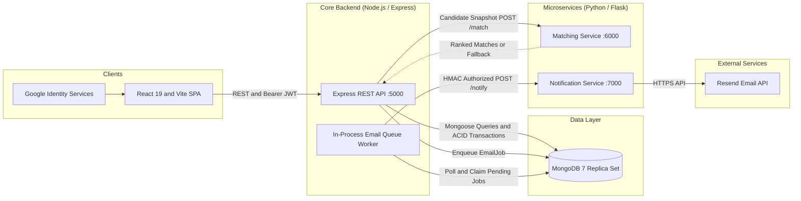
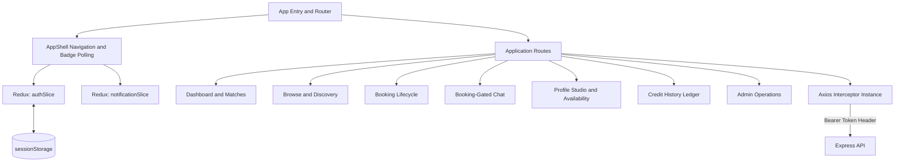
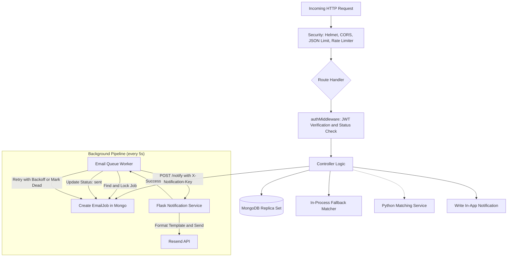
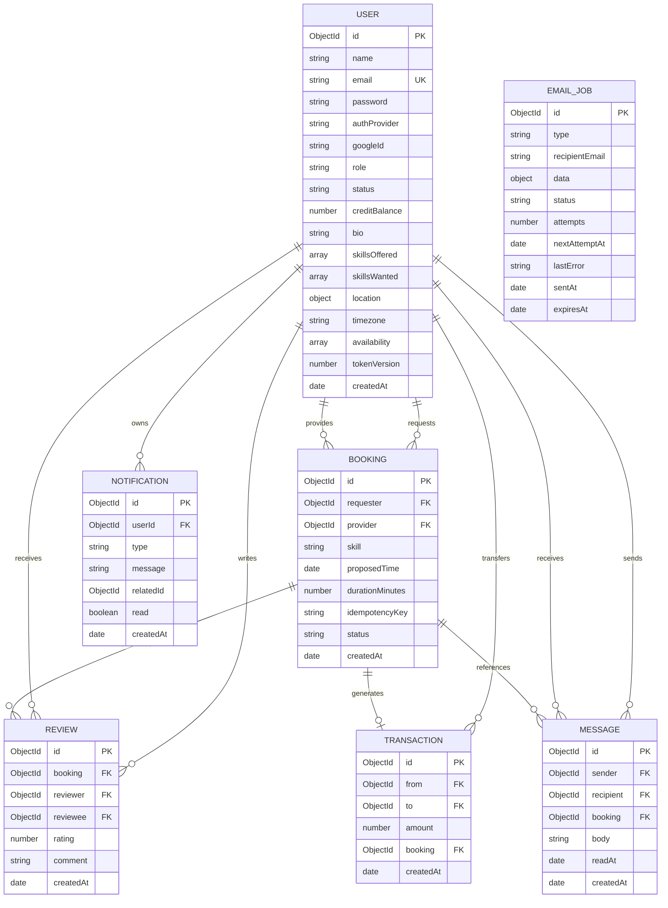
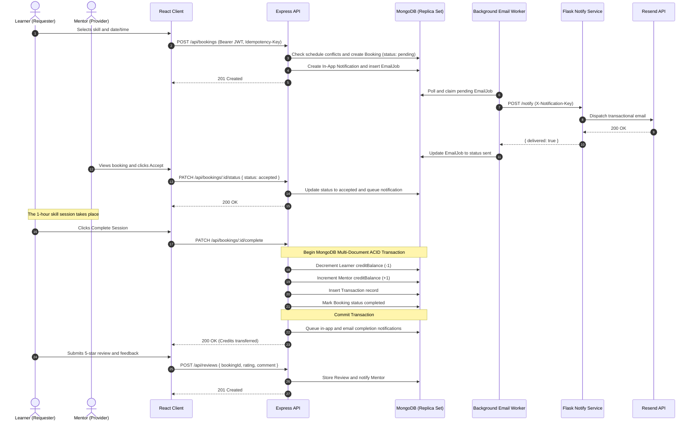

# SkillSwap

SkillSwap is a peer-to-peer knowledge exchange platform built on a time-banking economy. Members teach skills they love, learn subjects they are curious about, and exchange time credits instead of money—one hour taught equals one hour earned.

---

## Live Deployments

| Component | URL | Hosting Platform |
|---|---|---|
| **Frontend Web App** | [skillswap-rho-five.vercel.app](https://skillswap-rho-five.vercel.app) | **Vercel** |
| **Core API** | [skillswap-1-x54c.onrender.com](https://skillswap-1-x54c.onrender.com) | **Render** |
| **Matching Microservice** | [skillswap-vmma.onrender.com](https://skillswap-vmma.onrender.com) | **Render** |
| **Notification Microservice** | [skillswap-2-vtzd.onrender.com](https://skillswap-2-vtzd.onrender.com) | **Render** |

> [!NOTE]
> Free-tier instances on Render may spin down after periods of inactivity. If a request takes a moment on initial load, the services are waking up.

---

## Core Concepts and Highlights

* **Time Banking Economy:** Every new user starts with **5 complimentary time credits**. Completing a 1-hour session transfers 1 credit from learner to mentor atomically via MongoDB ACID transactions.
* **Microservices with Resilient Fallback:** Recommendation scoring runs in a dedicated Python Flask microservice. If the microservice is offline or sleeping, the Express API transparently falls back to an internal matching engine without service interruption.
* **Durable Notification Architecture:** User-facing requests never block on external email API calls. Email jobs are stored in MongoDB with exponential backoff and dispatched via a secure Flask service leveraging the Resend API.
* **Real-time In-App Notifications and Messaging:** Direct messaging is strictly gated to members with active bookings. In-app badge counters auto-refresh every 15 seconds or upon tab focus.

---

## Key Features

### Authentication and Onboarding
- **Dual Authentication Modes:** Email/password registration and one-click Google OAuth 2.0 (Google Identity Services).
- **Strict Email Hygiene:** Validates DNS MX records and rejects disposable/temporary email domains before creating an account.
- **Session Revocation:** JWT-based sessions supporting server-side invalidation via `tokenVersion` increments upon logout.
- **Interactive Onboarding:** First-time onboarding modal automatically guides new users to declare skills they want to learn and skills they can teach.

### Discovery and Smart Matching
- **Member Directory:** Search members by name, city, skills offered, and skills wanted with real-time query filtering.
- **Multi-Factor Recommendation Engine:**
  - `+1.0` score per matching wanted/offered skill.
  - `+0.25` bonus for overlapping weekly availability windows on identical days.
  - `+0.25` bonus for matching geographical city locations.
- **Community Reviews Modal:** Inspect member feedback, ratings, and testimonials before booking.

### Booking Lifecycle and Idempotency
- **Conflict Prevention:** Automated overlap validation prevents double-booking either participant's calendar.
- **Idempotency Protection:** Clients send unique `Idempotency-Key` headers (UUIDv4) to prevent duplicate booking charges or requests.
- **Session Status Progression:** `pending` -> `accepted` / `declined` -> `completed`.

### Transactional Time Credits
- **Zero-Sum Balance Transfers:** Requester pays 1 credit; provider earns 1 credit upon session completion.
- **ACID Transactions:** Powered by a MongoDB Replica Set session; prevents partial states or negative credit balances.
- **Ledger History:** Dedicated transaction ledger displaying full history of credits earned and spent.

### Booking-Gated Messaging
- **Contextual Communication:** Chat conversations are permitted only between members with accepted or completed bookings.
- **Unread Counters:** Automatically marks messages and related notifications as read when opening a thread.

### Reviews and Reputation
- **Verified Reviews Only:** Only booking participants can rate and review a completed exchange.
- **Double-Review Prevention:** Unique compound database indices ensure only one review per participant per booking.
- **Aggregated Ratings:** Real-time calculation of average ratings and total review counts per user.

### Administrative Console
- **Platform Analytics:** Real-time counters for registered users, active accounts, completed swaps, pending requests, transactions, and reviews.
- **Account Moderation:** One-click account suspension and reactivation.
- **Content Moderation:** Immediate deletion of flagged or abusive reviews.

---

## System Architecture

### High-Level Architecture



### Frontend Architecture



### Backend & Worker Pipeline



### Database Schema (ERD)



### Booking and Credit Lifecycle



### Smart Matching Algorithm

The recommendation engine calculates a match coefficient $S$ for each candidate relative to the current user:

$$S = S_{\text{skills}} + S_{\text{availability}} + S_{\text{location}}$$

1. **Skill Overlap ($S_{\text{skills}}$):**
   Number of normalized skills in candidate's `skillsOffered` that exist in user's `skillsWanted`.
   $$S_{\text{skills}} = |\text{skillsWanted} \cap \text{skillsOffered}|$$
2. **Availability Overlap ($S_{\text{availability}} = 0.25$):**
   Awarded if at least one candidate slot shares the same day of the week and has intersecting time ranges:
   $$\text{day}_A = \text{day}_B \quad \land \quad \text{start}_A < \text{end}_B \quad \land \quad \text{start}_B < \text{end}_A$$
3. **Geographic Proximity ($S_{\text{location}} = 0.25$):**
   Awarded if both user profiles have non-empty matching cities (case-insensitive).

---

## Technology Stack

| Layer | Technologies |
|---|---|
| **Frontend Web App** | React 19, Vite 8, React Router 7, Redux Toolkit 2, Axios, @react-oauth/google |
| **Styling and UI** | Responsive CSS custom properties, SVG iconography, modal systems, skeleton loaders |
| **Core API** | Node.js 20+, Express 5, Mongoose 8, bcryptjs, jsonwebtoken, google-auth-library, helmet, express-rate-limit |
| **Database** | MongoDB 7 (Replica Set required for multi-document ACID transactions) |
| **Microservices** | Python 3.11+, Flask 3.1, Gunicorn 23, Requests, python-dotenv |
| **Transactional Email**| Resend REST API with customizable template rendering |
| **Testing** | Jest 30, Supertest 7, mongodb-memory-server, Python unittest |
| **DevOps and Containers**| Docker, Docker Compose, Nginx (SPA routing), GitHub Actions CI |

---

## Repository Structure

```text
skillswap/
├── .github/
│   └── workflows/
│       └── ci.yml                     # GitHub Actions CI matrix
├── client/                            # React 19 + Vite frontend
│   ├── public/                        # Static assets (favicons, SVG icon sprites)
│   ├── src/
│   │   ├── api/                       # Axios client instance with auth interceptors
│   │   ├── assets/                    # Illustrations and graphic assets
│   │   ├── components/                # AppShell, OnboardingModal, Icon, AuthLayout
│   │   ├── pages/                     # Dashboard, Browse, Bookings, Messages, etc.
│   │   ├── redux/                     # Auth slice, notification slice, store setup
│   │   ├── App.jsx                    # Routing table and navigation guards
│   │   └── main.jsx                   # React root entrypoint
│   ├── Dockerfile                     # Multi-stage production build (Node build -> Nginx)
│   ├── nginx.conf                     # Nginx client routing configuration
│   └── vite.config.js                 # Vite bundler configuration
├── server/                            # Node.js + Express 5 API
│   ├── controllers/                   # Business logic (auth, bookings, reviews, etc.)
│   ├── middleware/                    # JWT auth, role validation (requireAdmin)
│   ├── models/                        # Mongoose schemas (User, Booking, Review, etc.)
│   ├── routes/                        # Express route definitions
│   ├── scripts/                       # Maintenance scripts (makeAdmin, migration)
│   ├── services/                      # notificationService and email queue worker
│   ├── tests/                         # Jest + Supertest integration test suites
│   ├── app.js                         # Express app middleware and routing setup
│   ├── server.js                      # DB connection, worker startup, graceful shutdown
│   └── Dockerfile                     # Node production image
├── matching-service/                  # Python Flask recommendation microservice
│   ├── app.py                         # Candidate scoring endpoint (/match)
│   ├── test_app.py                    # Unit tests for scoring logic
│   ├── requirements.txt               # Flask, Gunicorn dependencies
│   └── Dockerfile                     # Python container
├── notification-service/              # Python Flask email microservice
│   ├── app.py                         # Timing-safe HMAC endpoint (/notify) -> Resend
│   ├── test_app.py                    # Unit tests with mock Resend API
│   ├── requirements.txt               # Flask, Requests, Gunicorn dependencies
│   └── Dockerfile                     # Python container
├── docker-compose.yml                 # Multi-container local orchestration (Mongo replica set)
└── README.md
```

---

## Quick Start with Docker Compose

The fastest way to spin up the entire SkillSwap ecosystem (Frontend, API, Matching, Notifications, and a MongoDB Replica Set) is with Docker Compose.

### 1. Clone the repository
```bash
git clone https://github.com/eeemrann/skillswap.git
cd skillswap
```

### 2. Configure root environment
Create a `.env` file in the project root:
```env
RESEND_API_KEY=re_your_test_or_production_key
EMAIL_FROM=SkillSwap <onboarding@resend.dev>
LOCAL_NOTIFICATION_SERVICE_API_KEY=local-dev-shared-secret-12345
LOCAL_JWT_SECRET=super-secret-jwt-development-key-12345
GOOGLE_CLIENT_ID=
VITE_API_URL=http://localhost:5000/api
```

### 3. Launch containers
```bash
docker compose up --build
```

The services will automatically configure and become available at:
- **Frontend App:** [http://localhost:8080](http://localhost:8080)
- **Express API:** [http://localhost:5000](http://localhost:5000)
- **Matching Microservice:** [http://localhost:6000](http://localhost:6000)
- **Notification Microservice:** [http://localhost:7000](http://localhost:7000)
- **MongoDB Replica Set:** `localhost:27017` (Replica set `rs0` automatically initialized by `mongo-init`)

---

## Manual Local Development

If you prefer to run services individually without Docker, follow these instructions.

### Prerequisites
- **Node.js** 20.x or newer
- **Python** 3.11 or newer
- **MongoDB** 6.0+ running as a **replica set** (or a free cloud database on **MongoDB Atlas**)
- **Git**

### 1. MongoDB Replica Set
> [!IMPORTANT]
> SkillSwap uses multi-document transactions for booking credit transfers. MongoDB **must** run as a replica set. Standalone MongoDB instances without replica sets will reject session transactions.

If running MongoDB locally on your machine, initialize a replica set:
```bash
mongod --replSet rs0 --dbpath /path/to/data
```
In `mongosh`:
```javascript
rs.initiate()
```
*(Alternatively, create a free cluster on MongoDB Atlas, which is a replica set by default).*

---

### 2. Server API

```bash
cd server
npm install
cp .env.example .env
```

Configure `server/.env`:
```env
PORT=5000
MONGO_URI=mongodb://localhost:27017/skillswap?replicaSet=rs0
JWT_SECRET=development-jwt-secret-key-at-least-32-chars
JWT_EXPIRES_IN=1h
CLIENT_ORIGINS=http://localhost:5173,http://localhost:8080
MATCHING_SERVICE_URL=http://localhost:6000
NOTIFICATION_SERVICE_URL=http://localhost:7000
NOTIFICATION_SERVICE_API_KEY=shared-dev-service-secret
NOTIFICATION_SERVICE_TIMEOUT_MS=10000
TRUST_PROXY_HOPS=1
```

Start the API with hot-reload:
```bash
npm run dev
```

---

### 3. Frontend Client

```bash
cd ../client
npm install
cp .env.example .env.local
```

Configure `client/.env.local`:
```env
VITE_API_URL=http://localhost:5000/api
VITE_GOOGLE_CLIENT_ID=your-google-client-id.apps.googleusercontent.com
```

Start the Vite dev server:
```bash
npm run dev
```
Open [http://localhost:5173](http://localhost:5173) in your browser.

---

### 4. Matching Microservice

```bash
cd ../matching-service
# Create and activate virtual environment
python -m venv venv
# On Windows:
venv\Scripts\activate
# On macOS/Linux:
source venv/bin/activate

pip install -r requirements.txt
python app.py
```
Runs on [http://localhost:6000](http://localhost:6000).

---

### 5. Notification Microservice

```bash
cd ../notification-service
python -m venv venv
# On Windows:
venv\Scripts\activate
# On macOS/Linux:
source venv/bin/activate

pip install -r requirements.txt
cp .env.example .env
```

Configure `notification-service/.env`:
```env
PORT=7000
RESEND_API_KEY=re_your_resend_api_key
EMAIL_FROM=SkillSwap <onboarding@resend.dev>
NOTIFICATION_SERVICE_API_KEY=shared-dev-service-secret
```

Start the service:
```bash
python app.py
```
Runs on [http://localhost:7000](http://localhost:7000).

---

## Environment Variables Reference

### Express API (`server/.env`)

| Variable | Required | Default | Description |
|---|:---:|:---:|---|
| `MONGO_URI` | **Yes** | — | MongoDB URI (must include `?replicaSet=...` or Atlas URI) |
| `JWT_SECRET` | **Yes** | — | Cryptographic secret for signing session JWTs |
| `JWT_EXPIRES_IN` | No | `1h` | Token expiration duration (e.g. `1h`, `7d`) |
| `PORT` | No | `5000` | Port for the Express server to listen on |
| `CLIENT_ORIGINS` | No | *Local origins* | Comma-separated CORS whitelist for frontend origins |
| `GOOGLE_CLIENT_ID` | For Google Sign-in | — | Google OAuth Web Client ID for ID token validation |
| `MATCHING_SERVICE_URL` | No | `http://localhost:6000` | Base URL of the Python matching service |
| `MATCHING_SERVICE_TIMEOUT_MS` | No | `60000` | Timeout before using internal in-process fallback |
| `NOTIFICATION_SERVICE_URL` | For Emails | `http://localhost:7000` | Base URL of the notification service |
| `NOTIFICATION_SERVICE_API_KEY` | For Emails | — | Shared secret token passed in `X-Notification-Key` |
| `NOTIFICATION_SERVICE_TIMEOUT_MS` | No | `10000` | HTTP request timeout when calling notification service |
| `EMAIL_WORKER_INTERVAL_MS` | No | `5000` | Polling interval for background email queue worker |
| `TRUST_PROXY_HOPS` | On Proxies | `1` | Reverse proxy hop count (crucial for accurate rate limiting on Render) |
| `BLOCKED_EMAIL_DOMAINS` | No | — | Additional comma-separated list of disposable mail domains |

### Notification Microservice (`notification-service/.env`)

| Variable | Required | Default | Description |
|---|:---:|:---:|---|
| `PORT` | No | `7000` | Port for Flask/Gunicorn |
| `RESEND_API_KEY` | **Yes** | — | API key generated from [Resend](https://resend.com) |
| `EMAIL_FROM` | **Yes** | `onboarding@resend.dev`| Verified sender address (e.g. `SkillSwap <notify@domain.com>`) |
| `NOTIFICATION_SERVICE_API_KEY`| **Yes** | — | Timing-safe secret (must match API `NOTIFICATION_SERVICE_API_KEY`) |

### Client (`client/.env.local`)

| Variable | Required | Default | Description |
|---|:---:|:---:|---|
| `VITE_API_URL` | **Yes** | — | Target API endpoint (e.g. `http://localhost:5000/api`) |
| `VITE_GOOGLE_CLIENT_ID` | For Google Sign-in | — | Public Google OAuth 2.0 Web Client ID |

---

## API Reference

All routes except `/api/auth/register`, `/api/auth/login`, and `/api/auth/google` require an `Authorization: Bearer <JWT>` header.

### Authentication (`/api/auth`)
*Rate limited to 20 requests per 15 minutes per IP.*

| Method | Endpoint | Description | Request Body / Notes |
|---|---|---|---|
| `POST` | `/api/auth/register` | Register new user | `{ name, email, password }` |
| `POST` | `/api/auth/login` | Login existing user | `{ email, password }` |
| `POST` | `/api/auth/google` | Sign in or sign up via Google | `{ credential }` (Google ID Token) |
| `POST` | `/api/auth/logout` | Revoke user token version | *Requires Bearer JWT* |

### Users and Profiles (`/api/users`)

| Method | Endpoint | Description | Request Body / Notes |
|---|---|---|---|
| `GET` | `/api/users` | Browse active members | Paginated (`?page=1&limit=50`), includes ratings |
| `GET` | `/api/users/me` | Fetch authenticated user profile | Returns profile without hashed password |
| `PUT` | `/api/users/me` | Atomically update full profile | `{ bio, timezone, location, availability, skillsOffered, skillsWanted }` |
| `PUT` | `/api/users/me/skills` | Update offered/wanted skills | `{ skillsOffered: [], skillsWanted: [] }` |
| `PUT` | `/api/users/me/profile` | Update bio, location, availability | `{ bio, timezone, location, availability }` |

### Bookings (`/api/bookings`)

| Method | Endpoint | Description | Headers & Body |
|---|---|---|---|
| `POST` | `/api/bookings` | Create new session request | **Header:** `Idempotency-Key: <UUID>`<br>`{ providerId, skill, proposedTime, durationMinutes }` |
| `GET` | `/api/bookings` | List user's bookings | Returns incoming and outgoing bookings |
| `PATCH`| `/api/bookings/:id/status` | Accept or decline request | `{ status: "accepted" \| "declined" }` |
| `PATCH`| `/api/bookings/:id/complete` | Complete session & transfer credits | *Requester only. Executes ACID credit transaction.* |

### Credits (`/api/credits`)

| Method | Endpoint | Description | Notes |
|---|---|---|---|
| `GET` | `/api/credits/history` | Get credit ledger history | Populates `from` and `to` participant details |

### Matches (`/api/matches`)

| Method | Endpoint | Description | Notes |
|---|---|---|---|
| `GET` | `/api/matches` | Get recommended user matches | Dispatches to Python microservice or local fallback |

### Reviews (`/api/reviews`)

| Method | Endpoint | Description | Request Body / Notes |
|---|---|---|---|
| `POST` | `/api/reviews` | Review a completed booking | `{ bookingId, rating, comment }` |
| `GET` | `/api/reviews/mine` | List booking IDs user reviewed | Returns array of string booking IDs |
| `GET` | `/api/reviews/:userId` | Get user rating summary & list | Returns `{ averageRating, totalReviews, reviews }` |

### Messages (`/api/messages`)

| Method | Endpoint | Description | Request Body / Notes |
|---|---|---|---|
| `GET` | `/api/messages/unread` | Count unread messages | `{ count: number }` |
| `GET` | `/api/messages/:userId` | Get conversation messages | Marks received messages as read |
| `POST` | `/api/messages/:userId` | Send a direct message | `{ body: string, bookingId?: string }` |

### Notifications (`/api/notifications`)

| Method | Endpoint | Description | Request Body / Notes |
|---|---|---|---|
| `GET` | `/api/notifications` | Get notifications | Paginated (`?page=1&limit=50`) |
| `GET` | `/api/notifications/unread-count` | Breakdown of unread counts | `{ all, booking, message, review, credit }` |
| `PATCH`| `/api/notifications/:id/read` | Mark single notification read | — |
| `PATCH`| `/api/notifications/read` | Mark all notifications read | Optional `{ type: "booking" \| ... }` filter |

### Administration (`/api/admin`)
*Requires `role: 'admin'` claim.*

| Method | Endpoint | Description | Request Body / Notes |
|---|---|---|---|
| `GET` | `/api/admin/stats` | Platform totals | Users, bookings, swaps, transactions, reviews |
| `GET` | `/api/admin/users` | List all users | Paginated with status & role info |
| `PATCH`| `/api/admin/users/:id/status`| Suspend or restore account | `{ status: "active" \| "suspended" }` |
| `DELETE`| `/api/admin/reviews/:id` | Remove offensive review | Permanently deletes review document |

### Health Checks

| Service | Method | Route | Description |
|---|---|---|---|
| **API** | `GET` | `/health` | Returns `{ status: "ok", databaseConnected: true }` |
| **Matching** | `GET` | `/` | Returns `{ status: "Matching service is running" }` |
| **Notification** | `GET` | `/` | Returns `{ status: "Notification service is running" }` |

---

## Background Email Queue and Retry Worker

To guarantee high availability and sub-second response times on booking operations, emails are handled via a durable queue:

1. **Job Creation:** When a booking event triggers (`BOOKING_CREATED`, `BOOKING_ACCEPTED`, `BOOKING_DECLINED`, or `BOOKING_COMPLETED`), the Express API persists an `EmailJob` document in MongoDB.
2. **Worker Polling:** An in-process worker checks for eligible jobs (`status: 'pending'` and `nextAttemptAt <= now`) every 5 seconds.
3. **Timed Lock:** Claimed jobs transition to `status: 'processing'`. If a worker crashes, stalled jobs older than 10 minutes are automatically reclaimed.
4. **Timing-Safe Delivery:** The worker dispatches an authenticated HTTP POST to `notification-service/notify`, sending an `X-Notification-Key` header verified with `hmac.compare_digest`.
5. **Exponential Backoff:** If the external email provider fails:
   $$\Delta t_{\text{retry}} = \min(1\text{ hour}, 30\text{s} \times 2^{\text{attempts} - 1})$$
   Jobs permanently fail (`status: 'dead'`) after 5 unsuccessful attempts.
6. **Automatic Cleanup:** MongoDB TTL indices automatically purge processed jobs after 30 days.

---

## Administration and CLI Utilities

### Promote a User to Admin
Grant full administrator access to any user by email:
```bash
cd server
node scripts/makeAdmin.js user@example.com
```

### Legacy Migration: Remove Email Verification Data
For databases upgraded from older iterations that previously required email verification codes:
```bash
cd server
npm run migrate:remove-email-verification
```
*This unsets legacy schema fields (`emailVerified`, `emailVerificationCodeHash`) and deletes obsolete verification email jobs without impacting users or bookings.*

---

## Testing and Quality Assurance

### Run Backend Unit & Integration Tests
Uses Jest with `mongodb-memory-server` to run real database queries in an isolated in-memory replica set:
```bash
cd server
npm test -- --runInBand
```

### Frontend Linting & Build Verification
```bash
cd client
npm run lint
npm run build
```

### Python Microservice Tests
```bash
cd matching-service
python -m unittest -v

cd ../notification-service
python -m unittest -v
```

### Validate Docker Compose Configuration
```bash
docker compose config
```

---

## Production Deployment

### 1. Frontend (Vercel)
- **Framework Preset:** Vite
- **Root Directory:** `client`
- **Build Command:** `npm run build`
- **Output Directory:** `dist`
- **Environment Variables:**
  - `VITE_API_URL`: URL to your deployed API (e.g. `https://skillswap-1-x54c.onrender.com/api`)
  - `VITE_GOOGLE_CLIENT_ID`: Google OAuth Web Client ID

### 2. Core API (Render Web Service)
- **Runtime:** Node
- **Root Directory:** `server`
- **Build Command:** `npm ci`
- **Start Command:** `node server.js`
- **Environment Variables:**
  - `MONGO_URI`: MongoDB Atlas connection string with replica set support
  - `JWT_SECRET`: Random 64-character string
  - `CLIENT_ORIGINS`: Your Vercel frontend URL
  - `TRUST_PROXY_HOPS`: `1`
  - `MATCHING_SERVICE_URL`: URL to your deployed matching microservice
  - `NOTIFICATION_SERVICE_URL`: URL to your deployed notification microservice
  - `NOTIFICATION_SERVICE_API_KEY`: Strong shared secret

### 3. Microservices (Render Web Services)
- Deploy `matching-service` and `notification-service` using the included Dockerfiles or Python environments.
- On `notification-service`, set:
  - `RESEND_API_KEY`: Production Resend key
  - `EMAIL_FROM`: Verified domain address
  - `NOTIFICATION_SERVICE_API_KEY`: Matching secret used by the Core API

---

## Security and Resilience Design

* **Timing-Safe Service Authentication:** Service-to-service communication between Express and the notification microservice utilizes `hmac.compare_digest` to prevent timing attacks.
* **Token Invalidation on Logout:** User records feature a `tokenVersion`. Calling `/api/auth/logout` increments this counter, instantly invalidating all previously issued JWTs.
* **Comprehensive Rate Limiting:** Sensitive authentication endpoints are constrained to 20 requests per 15-minute window per IP with reverse-proxy awareness.
* **HTTP Security Headers:** Protected with `helmet` to set secure HTTP response headers and prevent common web vulnerabilities.
* **Strict Payload Boundaries:** Express JSON body parser is restricted to `100kb` to prevent memory flooding.
* **Database TTL Auto-Pruning:** In-app notifications expire automatically after 90 days, and email jobs expire after 30 days.

---

## Author and Acknowledgements

Created and maintained by **Mahdi Hasan** ([@eeemrann](https://github.com/eeemrann)).

Contributions, issues, and feature suggestions are welcome! Feel free to open a pull request or issue on the [GitHub repository](https://github.com/eeemrann/skillswap).
