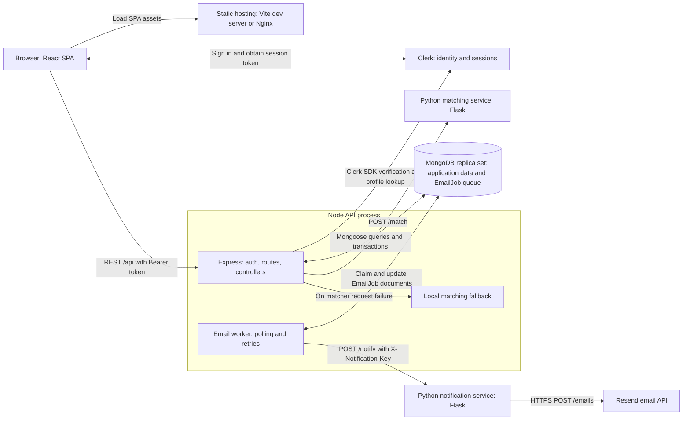
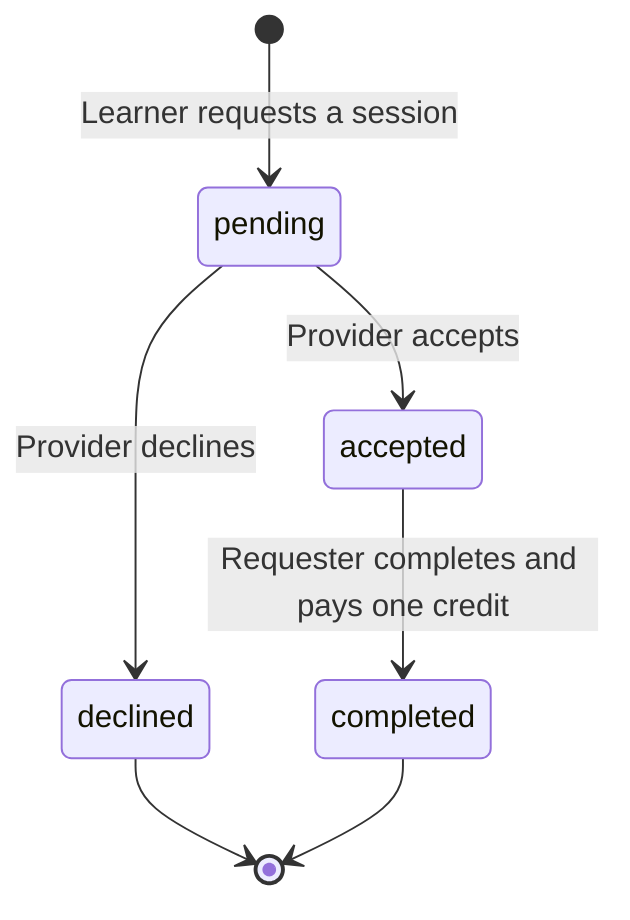
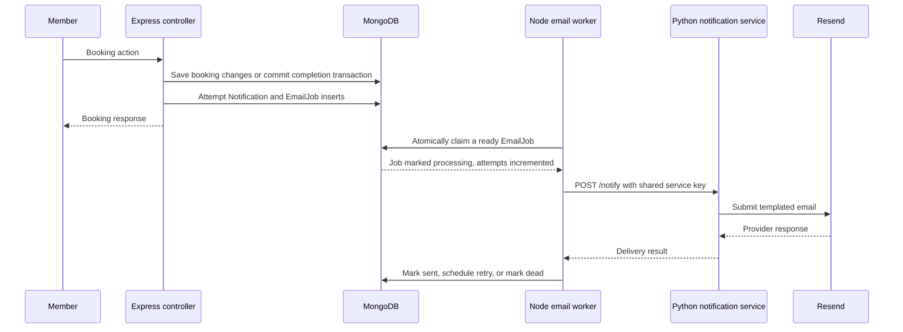
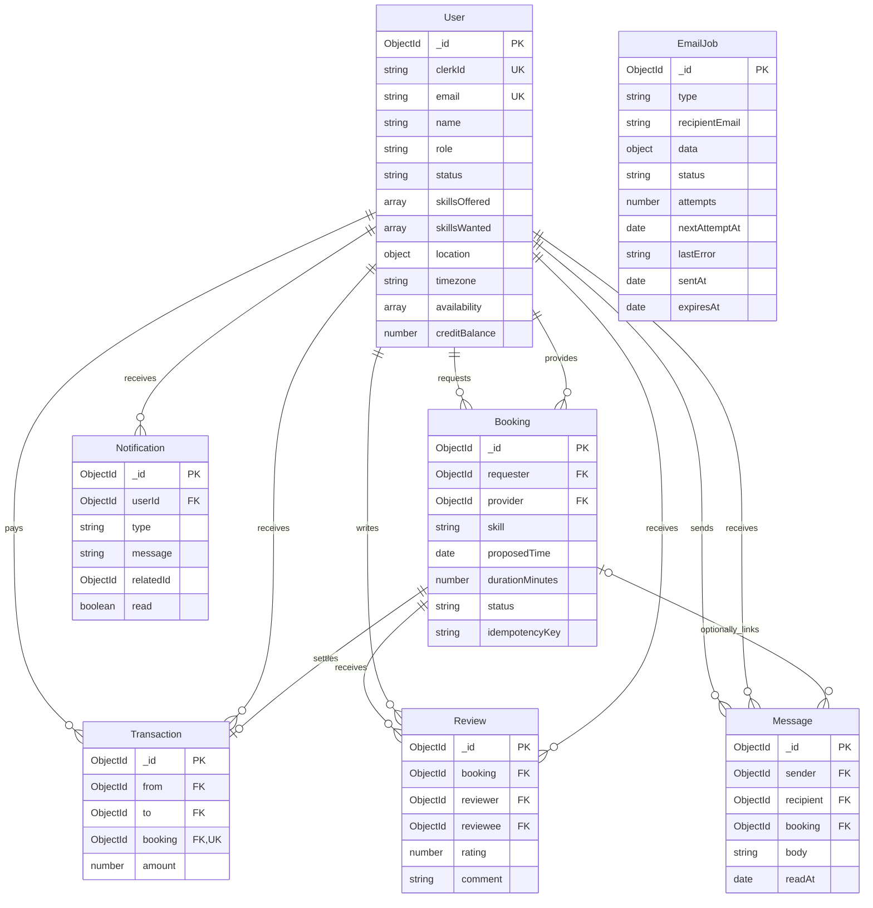

# SkillSwap

SkillSwap is a peer-to-peer skill exchange platform. Members share what they can teach, find people who offer skills they want to learn, arrange sessions, and exchange time credits after completion.

New profiles receive **5 credits**. Each completed booking transfers **1 credit** from the learner to the teacher, regardless of its duration. The current booking form requests one-hour sessions; the API accepts durations from 15 to 480 minutes.


## Features

- Clerk sign-in and sign-up, with authentication methods configured in the Clerk application.
- Automatic application-profile provisioning, first-login onboarding, skills, bio, location, timezone, and weekly availability.
- Nearby member discovery, member profiles, ratings, and skill recommendations.
- Booking requests, teacher acceptance or rejection, learner completion, and credit history.
- Conversations between members who share an accepted or completed booking.
- Reviews by either participant after a completed exchange.
- In-app notification counts and asynchronous booking emails through Resend.
- Admin statistics and account suspension/restoration; review deletion is available through the admin API.

## Architecture

The application has a React SPA, a central Express API, and two Python HTTP services. **Only the Node API accesses MongoDB.** Its process also runs the email queue worker. The matching service calculates scores from request data; the notification service formats and sends email.



Nginx serves the built SPA and supplies the client-side routing fallback. It does **not** proxy `/api`: the browser calls the URL compiled into `VITE_API_URL` directly. The Python services do not communicate with the browser or each other.

| Component | Stack | Development / Compose address |
| --- | --- | --- |
| Client | React 19, Vite 8, React Router 7, Redux Toolkit, Axios, Clerk React | `localhost:5173` / `localhost:8080` |
| API and email worker | Express 5, Mongoose 8, Clerk Express; Node 20 Docker image | `localhost:5000` |
| Matching service | Python 3.11, Flask, Gunicorn in Docker | `localhost:6000` |
| Notification service | Python 3.11, Flask, Requests, Gunicorn in Docker | `localhost:7000` |
| Database | MongoDB 7 in Compose, replica set `rs0` | `localhost:27017` |

The API starts listening and starts its worker only after MongoDB connects. A replica set is required for the multi-document transaction that settles a booking.

### Frontend state and refresh

`main.jsx` mounts React Router, Clerk, and Redux. `App.jsx` binds Clerk's token getter to Axios and loads `/api/users/me` before rendering protected pages. Axios obtains a Bearer token for requests and retries a `401` once. Redux holds the application profile, notification state, and search radius; the profile is cached in `sessionStorage`.

Updates use HTTP polling: messages every 5 seconds, bookings every 10 seconds, dashboard and notification counts every 15 seconds, and admin data every 30 seconds while visible. There is no WebSocket transport. The app shell also synchronizes browser coordinates on mount, focus, and reconnect when location access is available.

## Application workflows

### Authentication and profile provisioning

1. The Clerk components handle sign-in/sign-up. Enabled email and social authentication methods belong to the Clerk configuration.
2. Clerk middleware validates the session. Application middleware looks up the MongoDB user by `clerkId`.
3. If no linked profile exists, the API fetches the Clerk profile and upserts by email, linking an existing record or creating a new one with 5 credits.
4. Suspended users receive `403`. Admin authorization uses the role stored in MongoDB.
5. New members with no bio or skills see the onboarding modal. Profile edits are saved through `/api/users/me`.

The UI signs out through Clerk. The compatibility endpoint `/api/auth/logout` only increments the legacy `tokenVersion` field; it does not revoke a Clerk session. Legacy local-password/Google fields remain in the user schema, but there are no active local login or registration routes.

### Browse and recommendations

Both screens share an in-memory radius selection: **25, 50, 100, 200, 400 km, or Worldwide** (`radiusKm=worldwide`). It resets to 25 km on a full app reload and is not persisted.

| Behavior | Browse: `GET /api/users` | Recommendations: `GET /api/matches` |
| --- | --- | --- |
| Inputs | Query coordinates, radius, pagination | Current user's saved skills, availability, location, and requested radius |
| Candidate selection | Other non-suspended members | Other non-suspended members offering at least one wanted skill |
| Numeric radius | MongoDB `$geoNear` filters candidates by distance | Adds a location bonus; does **not** exclude distant candidates |
| Worldwide | Lists non-suspended members without a distance filter | Gives a location bonus when both members have valid coordinates |
| Missing coordinates | Lists non-suspended members; sets `X-Location-Fallback: true` | Falls back to case-insensitive city equality for the location bonus |
| Service/query failure | Falls back to the member list; if that also fails, returns `[]` | Runs the JavaScript scorer inside the API |

An empty successful nearby query remains empty; it does not expand to a worldwide search. The nearby aggregation joins reviews for rating summaries. Although it calculates distance, its final projection currently omits `distanceKm`.

Matching is deterministic, based on normalized skill strings:

```text
score = count(unique wanted skills offered by candidate)
      + 0.25 if weekly availability overlaps
      + 0.25 if location matches
```

The location bonus uses haversine distance when both coordinate arrays are valid, otherwise city equality. Coordinates use GeoJSON order **[longitude, latitude]**. Availability compares same-day time ranges directly; the scorer does not convert between users' timezones. The API waits up to 60 seconds by default for the Python service before using its local fallback.

### Bookings and credits



Creation requires an `Idempotency-Key` matching `[A-Za-z0-9_-]{8,100}`. Reusing a key for the same requester returns the existing booking. The API checks that the provider offers the skill, the start time is in the future, and neither participant has an overlapping pending or accepted booking. Acceptance repeats the overlap check.

Only the requester can complete an accepted booking. A MongoDB transaction checks their balance, debits one credit, credits the provider, inserts the ledger transaction, and changes the booking to `completed`. The unique `Transaction.booking` index prevents duplicate settlement. Credits are not reserved when requesting or accepting a booking.

### In-app notifications and email delivery



The worker starts immediately and polls every 5 seconds by default. Failed delivery retries begin after 30 seconds and double on subsequent failures; jobs become `dead` after five failed attempts. Jobs left `processing` for ten minutes can be reclaimed. Email jobs expire after 30 days, and in-app notifications expire after 90 days through MongoDB TTL indexes.

Emails cover `BOOKING_CREATED`, `BOOKING_ACCEPTED`, `BOOKING_DECLINED`, and `BOOKING_COMPLETED`. Clerk handles identity-verification email. Messages and reviews create in-app notifications only. A `sent` email job means the provider accepted the request, not confirmed inbox delivery.

Messaging requires an accepted or completed booking between the two users. Messages are limited to 2,000 characters; reading a conversation marks incoming messages and their associated notifications read. Reviews require a completed booking, a rating from 1 to 5, and at most one review per participant per booking.

## Data model



These are Mongoose references, not relational foreign-key constraints. `EmailJob` stores an email address and payload rather than a user/booking reference. `Notification.relatedId` identifies a booking, message, or review depending on its type. Messages can omit `booking` even though access still requires a qualifying booking.

Indexes include sparse unique Clerk and legacy Google IDs, a sparse `2dsphere` location index, a partial unique `(requester, idempotencyKey)` booking index, unique settlement per booking, unique `(booking, reviewer)` reviews, and indexes for queue polling and notification lookup.

## Repository layout

```text
skillswap/
|-- client/
|   |-- src/api/               Axios configuration and Clerk token injection
|   |-- src/components/        App shell, auth layout, onboarding, icons
|   |-- src/pages/             Public, member, and admin screens
|   |-- src/redux/             Profile, notifications, and radius state
|   |-- src/assets/            Image and SVG assets
|   |-- public/                Static icons
|   |-- Dockerfile             Vite build followed by Nginx hosting
|   |-- nginx.conf             SPA routing fallback
|   `-- vercel.json            Static deployment rewrite
|-- server/
|   |-- app.js                 Express middleware and route registration
|   |-- server.js              Database connection, HTTP server, email worker
|   |-- controllers/           Business rules and request handlers
|   |-- middleware/            Clerk profile sync and admin authorization
|   |-- models/                Seven Mongoose models and indexes
|   |-- routes/                Nine API route modules
|   |-- services/              In-app notifications and email queue worker
|   |-- scripts/               Admin promotion and legacy-data cleanup
|   `-- tests/                 Jest unit tests
|-- matching-service/          Flask scoring API and unittest suite
|-- notification-service/      Flask email gateway and unittest suite
|-- .github/workflows/ci.yml    Backend, frontend, Python, and Compose checks
|-- docker-compose.yml         Local services and replica-set initialization
`-- README.md
```

Each JavaScript application has its own package manifest and lockfile. The root `package.json` is not a workspace orchestrator and has no application scripts; install dependencies inside `client/` and `server/`.

## Run with Docker Compose

Requires Docker with Compose and a Clerk application. Real booking email additionally requires Resend credentials and a sender permitted by that account.

Create or update `.env` in the **repository root** with your own values:

```dotenv
CLERK_SECRET_KEY=sk_test_replace_me
VITE_CLERK_PUBLISHABLE_KEY=pk_test_replace_me
VITE_API_URL=http://localhost:5000/api
LOCAL_NOTIFICATION_SERVICE_API_KEY=replace-with-a-random-shared-secret
RESEND_API_KEY=re_replace_me
EMAIL_FROM=SkillSwap <notifications@your-verified-domain.com>
```

Use Clerk keys from the same application. Configure its sign-in methods and local application URLs. Compose reads this root file for interpolation; it does not load `server/.env` or the notification service's `.env` automatically.

From the repository root:

```sh
docker compose config --quiet
docker compose up --build
```

Open **http://localhost:8080**. API readiness is available at **http://localhost:5000/health**. MongoDB data persists in the `mongo-data` named volume. The one-shot `mongo-init` container initializes `rs0`; the server waits for it to finish.

The client API URL must be reachable by the **browser**. `http://server:5000/api` is a container-network address and is unsuitable for the host browser. Changes to `VITE_*` values require rebuilding the client.

```sh
docker compose logs -f server notification-service
docker compose down
```

`docker compose down` retains the database volume. Missing email credentials do not prevent booking operations, but queued delivery attempts will fail and eventually become dead jobs.

## Local development

Use Node **22.13+ within the 22.x line** to satisfy the checked-in frontend tooling, Python 3.11, and a MongoDB replica set or Atlas database. CI uses Node 20 for the API, Node 22 for the frontend, and Python 3.11 for both services.

The commands below use PowerShell from the repository root. For macOS/Linux, replace `Copy-Item` with `cp` and use the virtual environment's `bin/python` in place of `Scripts/python.exe`.

### 1. Configure MongoDB

Use an Atlas replica-set connection string, or run a local `mongod` with `--replSet rs0`, an existing data directory, and a reachable bind address. Initialize a new local replica set once through `mongosh`:

```javascript
rs.initiate({ _id: "rs0", members: [{ _id: 0, host: "localhost:27017" }] })
```

For that local setup, set `MONGO_URI=mongodb://localhost:27017/skillswap?replicaSet=rs0`.

The Compose replica set advertises `mongo:27017` to its containers. A host-run API cannot normally resolve that name; use Atlas or a separately configured local replica set for this workflow.

### 2. Start the API

```powershell
cd server
npm ci
Copy-Item .env.example .env
# Edit .env: set MONGO_URI, CLERK_SECRET_KEY, and service configuration.
npm run dev
```

### 3. Start the client in another terminal

```powershell
cd client
npm ci
Copy-Item .env.example .env.local
# Edit .env.local before starting Vite.
npm run dev
```

Set `VITE_API_URL=http://localhost:5000/api` and your `VITE_CLERK_PUBLISHABLE_KEY`. **The checked-in client example points to a hosted API**, so override that URL for local development. Open the Vite URL printed in the terminal, normally http://localhost:5173.

### 4. Start the matching service in another terminal

```powershell
cd matching-service
python -m venv .venv
.\.venv\Scripts\python.exe -m pip install -r requirements.txt
.\.venv\Scripts\python.exe app.py
```

Matching still works through the API's local fallback if this service is unavailable, after the configured request timeout.

### 5. Start the notification service in another terminal

```powershell
cd notification-service
python -m venv .venv
.\.venv\Scripts\python.exe -m pip install -r requirements.txt
Copy-Item .env.example .env
# Edit .env: set Resend credentials and the same service key as server/.env.
.\.venv\Scripts\python.exe app.py
```

## Configuration

Local environment files are ignored by Git. Keep secret keys server-side; `VITE_*` values are embedded in public browser assets.

### Client: `client/.env.local`

| Variable | Behavior |
| --- | --- |
| `VITE_CLERK_PUBLISHABLE_KEY` | Required Clerk browser key |
| `VITE_API_URL` | API base URL including `/api`; set explicitly for your environment |

Without `VITE_API_URL`, Axios chooses localhost on `localhost`/`127.0.0.1`, otherwise the hosted Render URL embedded in `client/src/api/axios.js`.

### API: `server/.env`

| Variable | Default / purpose |
| --- | --- |
| `MONGO_URI` | Required database connection string with replica-set support |
| `CLERK_SECRET_KEY` | Required for the intended Clerk authentication setup |
| `CLERK_PUBLISHABLE_KEY` | Present in the example and read by auth diagnostics; Compose does not pass it to the API |
| `PORT` | `5000` |
| `CLIENT_ORIGINS` | Comma-separated origins added to built-in localhost and project origins; `CLIENT_ORIGIN` is a fallback alias |
| `TRUST_PROXY_HOPS` | `1`; Express proxy trust setting |
| `MATCHING_SERVICE_URL` | `http://localhost:6000` |
| `MATCHING_SERVICE_TIMEOUT_MS` | `60000` |
| `NOTIFICATION_SERVICE_URL` | No default; required for email delivery |
| `NOTIFICATION_SERVICE_API_KEY` | Shared secret sent as `X-Notification-Key` |
| `NOTIFICATION_SERVICE_TIMEOUT_MS` | `10000` in code; example and Compose set `30000` |
| `EMAIL_WORKER_INTERVAL_MS` | `5000` |

`JWT_SECRET`, `JWT_EXPIRES_IN`, `GOOGLE_CLIENT_ID`, and `BLOCKED_EMAIL_DOMAINS` remain in example/Compose configuration but are not used by the active application authentication flow. Compose also passes the unused `VITE_GOOGLE_CLIENT_ID` build argument.

### Python services

| Service | Variable | Default / purpose |
| --- | --- | --- |
| Matching | `PORT` | `6000` |
| Notifications | `PORT` | `7000` |
| Notifications | `NOTIFICATION_SERVICE_API_KEY` | Required for `/notify`; must match the Node API |
| Notifications | `RESEND_API_KEY` | Required for provider submission |
| Notifications | `EMAIL_FROM` | `onboarding@resend.dev` in code; configure your permitted sender |

The notification service loads its `.env` through `python-dotenv`. The matching service reads the process environment and does not load a `.env` file.

## API reference

All `/api` endpoints below require an authenticated Clerk session. Admin endpoints additionally require a MongoDB user with `role: admin`. Send JSON request bodies and `Authorization: Bearer <Clerk-session-token>`.

Public service checks:

| Service | Method and path | Result |
| --- | --- | --- |
| Express | `GET /` | API status text |
| Express | `GET /health` | `200` when MongoDB is connected; otherwise `503` |
| Matching | `GET /` | Process health message |
| Notifications | `GET /` | Process health message; does not validate Resend configuration |

### Profiles and discovery

| Method | Path | Purpose |
| --- | --- | --- |
| GET | `/api/users/me` | Current application profile |
| PUT | `/api/users/me` | Save skills and profile fields |
| PUT | `/api/users/me/skills` | Save `skillsOffered` and `skillsWanted` |
| PUT | `/api/users/me/profile` | Update provided profile fields |
| PATCH | `/api/users/me/location` | Save numeric `longitude` and `latitude` |
| GET | `/api/users` | Browse; accepts `lng`, `lat`, `radiusKm`, `page`, `limit` |
| GET | `/api/users/:id` | Community-facing member profile; accepts MongoDB or Clerk ID |
| GET | `/api/matches` | Ranked matches; accepts `radiusKm` |

### Bookings, credits, reviews, and messages

| Method | Path | Purpose |
| --- | --- | --- |
| GET | `/api/bookings` | Participant's bookings; `page`, `limit`, and `X-Total-Count` |
| POST | `/api/bookings` | Request booking; requires `Idempotency-Key` |
| PATCH | `/api/bookings/:id/status` | Provider sets `status` to `accepted` or `declined` |
| PATCH | `/api/bookings/:id/complete` | Requester completes and transfers one credit |
| GET | `/api/credits/history` | Incoming/outgoing ledger entries; accepts `limit` |
| POST | `/api/reviews` | Submit `bookingId`, `rating`, optional `comment` |
| GET | `/api/reviews/mine` | Array of booking IDs the current user has **already reviewed** |
| GET | `/api/reviews/:userId` | `{ averageRating, totalReviews, reviews }`; accepts `page`, `limit` |
| GET | `/api/reviews/user/:userId` | Alias for the user-review endpoint |
| GET | `/api/messages/unread` | `{ count }` of unread messages |
| GET | `/api/messages/:userId` | Conversation; marks incoming messages read; accepts `limit` |
| POST | `/api/messages/:userId` | Send `body` with optional `bookingId` |

Booking request body:

```json
{
  "providerId": "<MongoDB user ID>",
  "skill": "Guitar",
  "proposedTime": "<future ISO-8601 timestamp>",
  "durationMinutes": 60
}
```

Most paginated lists default to 50 items and cap at 100. User reviews default to 20. Conversations default to the latest 100 messages, cap at 200, and return those messages in chronological order.

### Notifications, administration, and compatibility

| Method | Path | Purpose |
| --- | --- | --- |
| GET | `/api/notifications` | Current user's notifications; accepts `page`, `limit` |
| GET | `/api/notifications/unread-count` | Counts for `all`, `booking`, `message`, `review`, and `credit` |
| PATCH | `/api/notifications/:id/read` | Mark one owned notification read |
| PATCH | `/api/notifications/read` | Mark all read, or supply `{ "type": "booking" }` to select a type |
| GET | `/api/admin/stats` | User, booking, transaction, and review counters |
| GET | `/api/admin/users` | Member list; `page`, `limit`, and `X-Total-Count` |
| PATCH | `/api/admin/users/:id/status` | Set `active` or `suspended`; self-suspension is rejected |
| DELETE | `/api/admin/reviews/:id` | Remove a review |
| POST | `/api/auth/logout` | Legacy token-version increment; UI logout uses Clerk |

Internal service contracts:

- `POST :6000/match`: accepts `mySkillsWanted`, `myLocation`, `myAvailability`, `radiusKm`, and `candidates`; returns entries with `id`, `name`, `matchedSkills`, `score`, and `matchReasons`. This endpoint has no application authentication.
- `POST :7000/notify`: requires `X-Notification-Key` and `{ type, recipientEmail, data }`; returns `{ delivered: true }` after provider acceptance. Template data uses `actor`, `skill`, and `time` as applicable.

## Frontend routes

| Route | Access | Screen |
| --- | --- | --- |
| `/` | Public | Landing page |
| `/login/*`, `/register/*` | Public authentication flow | Clerk sign-in/sign-up |
| `/dashboard` | Member | Recommendations and activity |
| `/browse` | Member | Member discovery |
| `/profile/:id` | Member | Profile, reviews, and booking form |
| `/bookings` | Member | Requests, responses, completion, and reviews |
| `/messages` | Member | Booking-connected conversations |
| `/edit-skills` | Member | Skills, bio, location, timezone, and availability |
| `/credits` | Member | Credit history |
| `/admin` | Admin | Platform counters and member access management |

Unknown client routes redirect to `/dashboard`. Signed-in visitors to login/register redirect there too.

## Tests and CI

Run commands inside the indicated directories after installing dependencies:

| Directory | Command | Existing coverage/check |
| --- | --- | --- |
| `server/` | `npm test` | Jest: Clerk/profile middleware, admin authorization and self-suspension, booking creation, matching fallback/radius, message validation, notification integration |
| `client/` | `npm run lint` | ESLint |
| `client/` | `npm run build` | Vite production build |
| `matching-service/` | `python -m unittest -v` | Flask contract, skill scoring, availability overlap, radius, Worldwide, city fallback |
| `notification-service/` | `python -m unittest -v` | Public health, shared-key enforcement, missing provider configuration |
| Repository root | `docker compose config --quiet` | Compose configuration validation |

For virtual environments, use their Python executable for the unittest commands. The [CI workflow](.github/workflows/ci.yml) runs these categories on pushes and pull requests to `main`, using `npm ci` for each JavaScript application and each Python service's requirements file.

The server tests mock database/provider dependencies. There is no checked-in browser end-to-end suite or integration test proving credit settlement against a running MongoDB replica set.

## Operations and deployment

To promote an existing application user, run from `server/` with its database configuration loaded:

```sh
node scripts/makeAdmin.js member@example.com
```

The member must have a MongoDB profile first, normally created by signing in and loading the application.

For databases retaining pre-Clerk email-verification data, the following maintenance command removes the three legacy verification fields from users and deletes `EMAIL_VERIFICATION` jobs:

```sh
npm run migrate:remove-email-verification
```

Deployment follows the same service boundaries as the architecture diagram:

- Build the client with its destination API URL and Clerk publishable key. Serve `client/dist` with a SPA fallback; Nginx and Vercel configurations are included.
- Run the API with `node server.js` after dependency installation. It also owns the background email worker, so worker availability follows API process uptime.
- Run Python services with their Dockerfiles/Gunicorn; `python app.py` is the local development entry point.
- Use a reachable MongoDB replica set. The Compose database is a single-node development replica set.
- Set browser origins and proxy hops for your deployment. Current CORS handling adds configured origins to built-in defaults and permits both HTTP and HTTPS variants; it does not replace the defaults.
- Keep the matching endpoint on an appropriate internal network. Compose publishes both Python ports for local access.

Express uses Helmet and a 100 KB JSON body limit. The 20-requests-per-15-minutes limiter is mounted only on `/api/auth`, whose sole route is the compatibility logout handler; it does not limit Clerk sign-in or the other API routes.


Maintained by [Mahdi Hasan](https://github.com/eeemrann).
