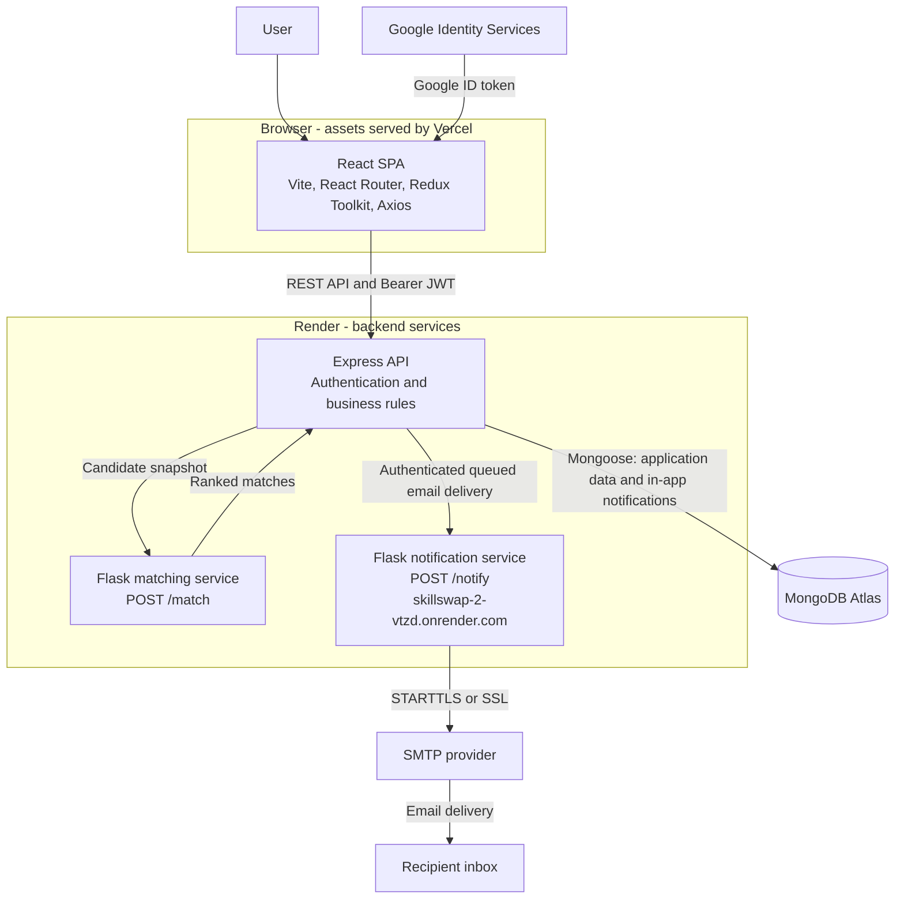
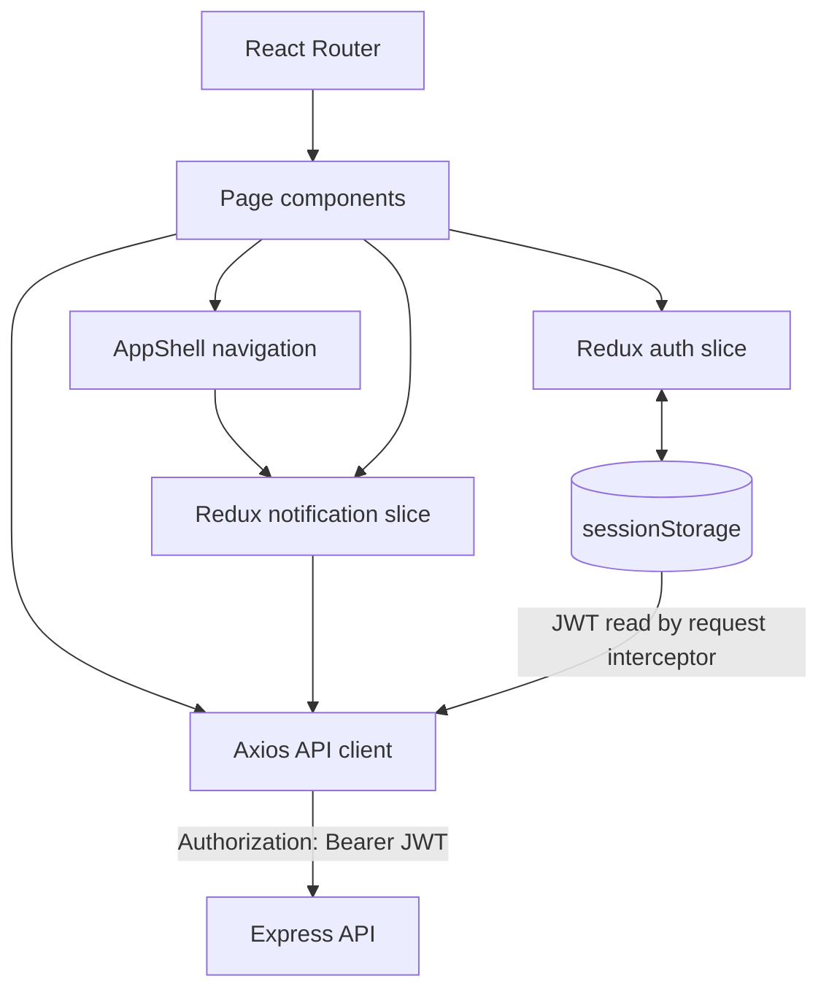
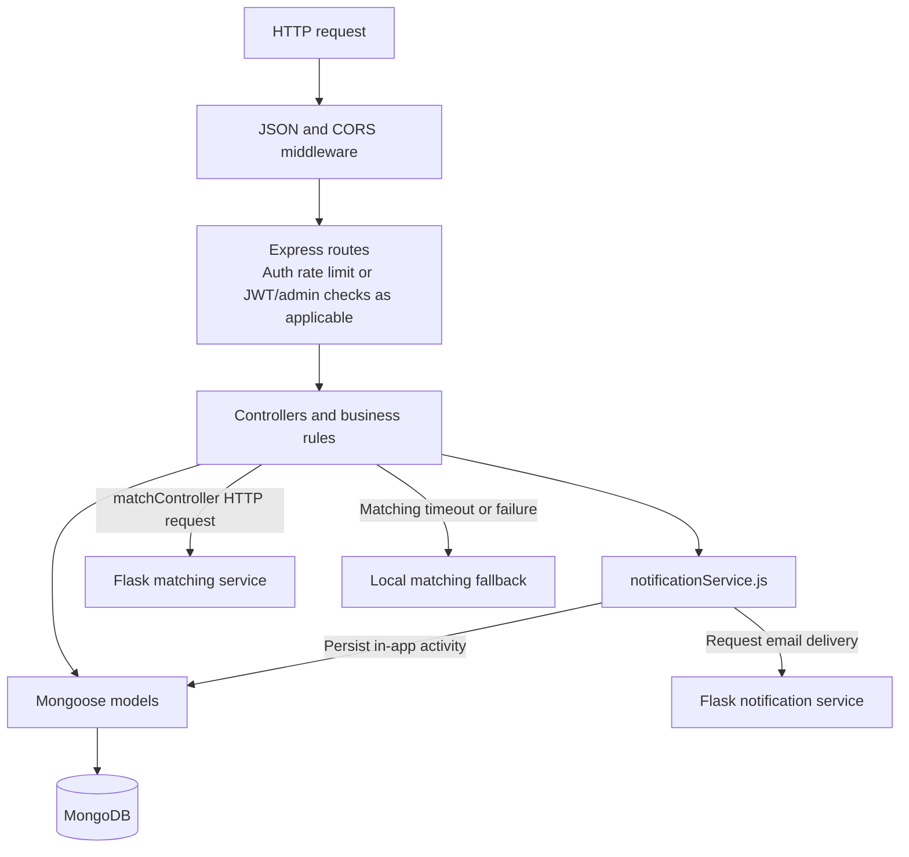
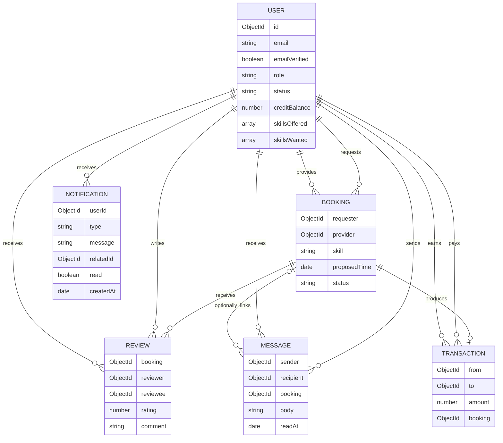
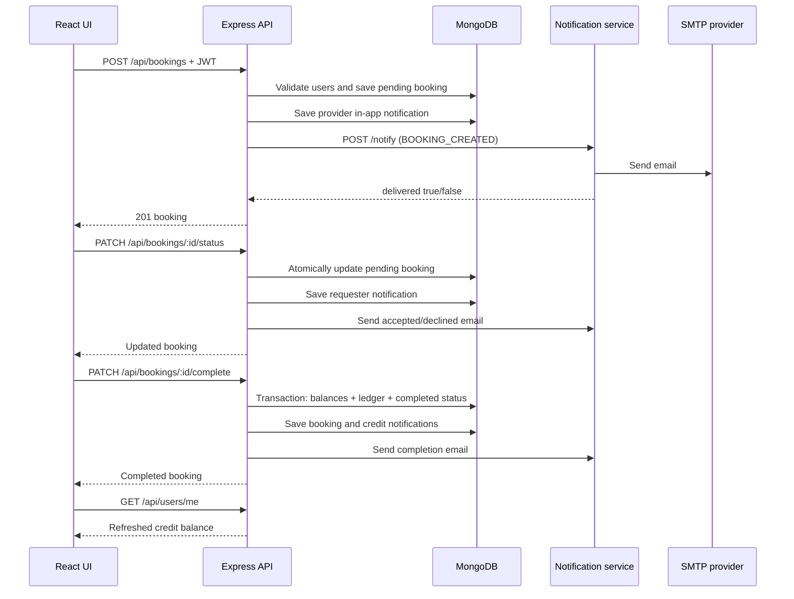
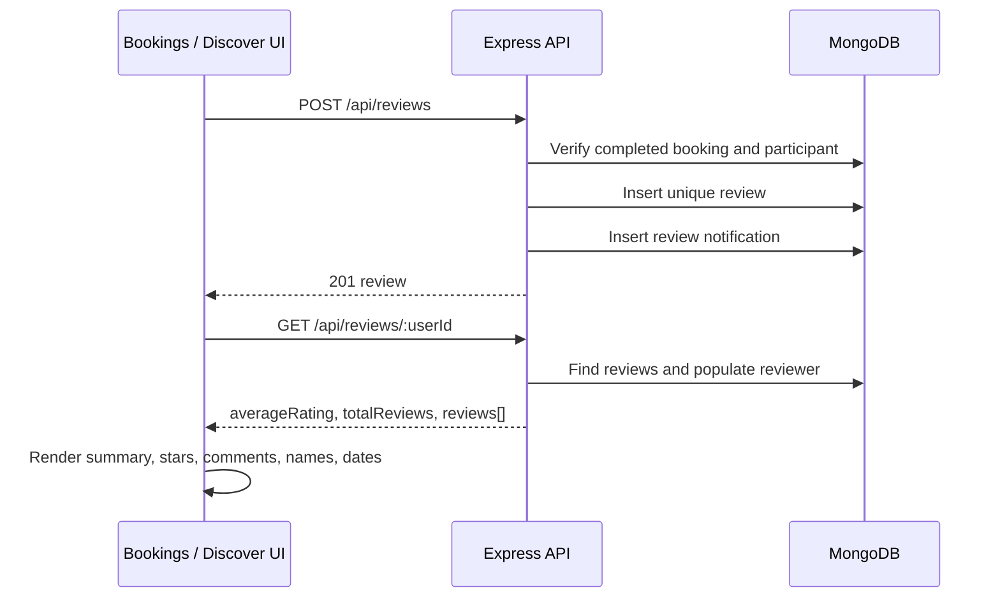
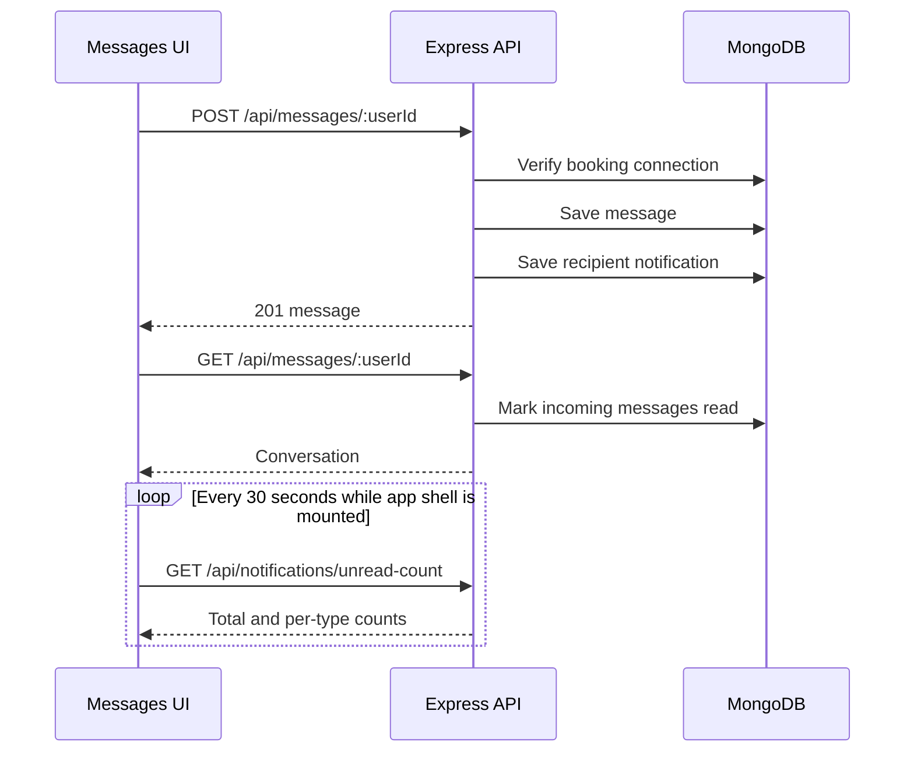

# SkillSwap

SkillSwap is a peer-to-peer learning platform where people teach skills, learn from one another, and exchange time credits instead of money. It includes profiles, skill discovery, matching, bookings, messaging, reviews, credit transfers, email delivery, in-app notifications, and administration tools.

## Live services

| Service | URL | Host |
|---|---|---|
| Frontend | [skillswap-rho-five.vercel.app](https://skillswap-rho-five.vercel.app) | Vercel |
| Main API | [skillswap-1-x54c.onrender.com](https://skillswap-1-x54c.onrender.com) | Render |
| Matching service | [skillswap-vmma.onrender.com](https://skillswap-vmma.onrender.com) | Render |
| Notification service | [skillswap-2-vtzd.onrender.com](https://skillswap-2-vtzd.onrender.com/) | Render |

> Render free-tier services can take 30–60 seconds to wake after inactivity. The API uses longer downstream timeouts and has a local matching fallback, but the first request can still be slower than normal.

## Features

- Verified email/password registration and Google authentication with JWT authorization
- Profiles with skills offered, skills wanted, location, timezone, availability, and bio
- Community browsing with ratings and detailed reviews
- Skill recommendations based on skill overlap, availability, and location
- Booking lifecycle: pending → accepted/declined → completed
- Atomic one-credit transfer when an accepted booking is completed
- Messaging between users who have an accepted or completed booking
- Reviews from either participant after a completed booking
- Persisted in-app notifications with unread badges
- Booking email notifications through a separate SMTP service
- Admin statistics, account suspension, and review removal APIs
- Docker Compose development environment and GitHub Actions CI

## Architecture

SkillSwap uses a browser SPA, a single authenticated application API, MongoDB, and two small Python services. The Express API is the system boundary for the browser: the frontend never calls MongoDB, the matching service, the notification service, or SMTP directly.

### System context



### Responsibilities and boundaries

| Component | Owns | Does not own |
|---|---|---|
| React SPA | Routing, forms, local page state, auth state, notification state, feedback, unread polling | Business authorization, direct database access, email delivery |
| Express API | Authentication, authorization, validation, booking workflow, credit transaction, messages, reviews, notification persistence, durable email queue, admin operations | Rendering the SPA, SMTP transport |
| MongoDB | Users, bookings, transactions, messages, reviews, in-app notifications, and retryable email jobs | Matching calculations or SMTP transport |
| Matching service | Stateless scoring of candidates supplied by the API | User authentication or database access |
| Notification service | Email-verification and booking templates plus SMTP transport | In-app notifications or booking persistence |

The two notification concepts are intentionally separate:

- **In-app notifications** are MongoDB documents created by the Express API and displayed by the React application.
- **Email notifications** are account-verification and booking-event messages sent by the Flask notification service through SMTP.

### Frontend architecture



Redux is deliberately limited to cross-page state:

- `authSlice`: user and short-lived JWT, persisted to `sessionStorage`
- `notificationSlice`: recent notifications and unread counts

Bookings, reviews, conversations, transactions, matches, and profile forms use component-local state because they are currently page-scoped.

### Backend architecture



The API is assembled in `server/app.js`; `server/server.js` connects Mongoose and starts the HTTP listener. Protected routes run `authMiddleware`, which verifies the JWT and reloads the current role/status from MongoDB so suspended accounts and role changes take effect without issuing a new token.

### Data model



Important constraints:

- A user cannot book themselves.
- Only the provider can accept or decline a pending booking.
- Only the requester can complete an accepted booking.
- Completion moves one credit from requester to provider in a MongoDB transaction.
- Messaging requires an accepted or completed booking between both users.
- A participant can review a completed booking once; `{ booking, reviewer }` is unique.
- Notification types are `booking`, `message`, `review`, and `credit`.

## End-to-end flows

### Booking, credits, and notifications



Email is stored as a durable MongoDB job during the application request. A worker retries transient failures with exponential backoff and records terminal failures for diagnosis. The Flask endpoint requires a shared service key, and a trailing slash in the configured URL remains safe.

### Reviews



### Messages and unread activity



This is polling, not WebSocket-based real-time delivery.

### Matching and fallback

The Express API loads the current user and candidate profiles from MongoDB, then sends a reduced snapshot to `POST /match`. The Flask service is stateless and scores:

1. `+1` for each wanted skill offered by a candidate
2. `+0.25` for an identical availability slot
3. `+0.25` for the same city

If the matching service is unavailable or times out, the Express controller runs the same scoring logic locally and still returns recommendations.

## Repository structure

```text
skillswap/
├── client/                       React/Vite SPA
│   ├── src/api/axios.js          API base URL and JWT interceptors
│   ├── src/components/           Shell, auth layout, onboarding, icons
│   ├── src/pages/                Route-level UI
│   ├── src/redux/                Auth and notification slices
│   ├── Dockerfile                Vite build + Nginx runtime
│   └── vercel.json               SPA rewrite configuration
├── server/                       Express application API
│   ├── controllers/              Business workflows
│   ├── middleware/               JWT and admin authorization
│   ├── models/                   Mongoose schemas
│   ├── routes/                   REST route definitions
│   ├── services/                 Downstream notification adapter
│   ├── tests/                    Jest controller/service tests
│   ├── app.js                    Express composition
│   └── server.js                 Mongo connection and listener
├── matching-service/             Stateless Flask matcher
├── notification-service/         Flask SMTP delivery service
├── .github/workflows/ci.yml      CI checks
└── docker-compose.yml            Local multi-service environment
```

## Technology stack

| Layer | Technology |
|---|---|
| Frontend | React 19, React Router 7, Redux Toolkit, Axios, Vite 8 |
| Main API | Node.js, Express 5, Mongoose 8 |
| Database | MongoDB / MongoDB Atlas |
| Authentication | JWT, bcryptjs, Google Identity Services |
| Matching | Python 3.11, Flask, Gunicorn |
| Email delivery | Python 3.11, Flask, `smtplib`, SMTP STARTTLS/SSL |
| Testing | Jest with controller and service mocks |
| Deployment | Vercel, Render, Docker, Nginx |

## Local development

### Prerequisites

- Node.js 20+
- Python 3.11+
- MongoDB replica set or MongoDB Atlas
- Docker and Docker Compose if using containers

MongoDB transactions require a replica set. A standalone local MongoDB instance can serve most endpoints, but booking completion will fail unless transactions are supported. MongoDB Atlas supports the required transaction behavior.

### 1. Main API

```bash
cd server
npm install
cp .env.example .env
npm run dev
```

Runs at `http://localhost:5000`.

### 2. Matching service

```bash
cd matching-service
python -m venv venv
# Windows: venv\Scripts\activate
# macOS/Linux: source venv/bin/activate
pip install -r requirements.txt
python app.py
```

Runs at `http://localhost:6000`.

### 3. Notification service

```bash
cd notification-service
python -m venv venv
# Windows: venv\Scripts\activate
# macOS/Linux: source venv/bin/activate
pip install -r requirements.txt
cp .env.example .env
python app.py
```

Runs at `http://localhost:7000`.

### 4. Frontend

```bash
cd client
npm install
cp .env.example .env.local
npm run dev
```

Runs at `http://localhost:5173`.

### Docker Compose

Create a root `.env` containing the shared variables, then run:

```bash
docker compose up --build
```

The frontend is exposed at `http://localhost:8080`; API, matching, and notification services are exposed on ports `5000`, `6000`, and `7000`.

## Environment variables

### Express API (`server/.env` or Render main API)

| Variable | Required | Purpose | Production value/example |
|---|---:|---|---|
| `MONGO_URI` | Yes | MongoDB connection string | Atlas replica-set URI |
| `JWT_SECRET` | Yes | Signs short-lived JWTs | Long random secret |
| `GOOGLE_CLIENT_ID` | For Google login | Server-side token audience | Google web client ID |
| `PORT` | Yes | Express listener | Render supplies this |
| `MATCHING_SERVICE_URL` | No | Remote matcher; local fallback exists | `https://skillswap-vmma.onrender.com` |
| `MATCHING_SERVICE_TIMEOUT_MS` | No | Matcher timeout | `60000` |
| `NOTIFICATION_SERVICE_URL` | For booking email | Email microservice base URL | `https://skillswap-2-vtzd.onrender.com/` |
| `NOTIFICATION_SERVICE_TIMEOUT_MS` | No | Email service timeout | `30000` |
| `NOTIFICATION_SERVICE_API_KEY` | Yes | Shared secret for authenticated email-service calls | random long value |
| `CLIENT_ORIGINS` | Yes in production | Comma-separated browser origins allowed by CORS | `https://your-app.vercel.app` |
| `TRUST_PROXY_HOPS` | No | Trusted reverse-proxy hop count | `1` |
| `JWT_EXPIRES_IN` | No | JWT lifetime | `1h` |

The production main API must have this exact relationship configured:

```env
NOTIFICATION_SERVICE_URL=https://skillswap-2-vtzd.onrender.com/
NOTIFICATION_SERVICE_API_KEY=use-the-same-random-value-on-both-services
CLIENT_ORIGINS=https://skillswap-rho-five.vercel.app
```

Do not append `/notify`; the Node service adds that path itself.

### Notification service (Render)

| Variable | Required | Purpose |
|---|---:|---|
| `PORT` | Render supplies it | Flask listener |
| `SMTP_HOST` | Yes | SMTP server hostname |
| `SMTP_PORT` | Yes | Usually `587` for STARTTLS or `465` for SSL |
| `SMTP_SECURE` | Yes | `starttls`, `ssl`, or another value for plain SMTP |
| `SMTP_USER` | Yes | SMTP login |
| `SMTP_PASSWORD` | Yes | SMTP password or provider app password |
| `EMAIL_FROM` | Yes | Sender header, for example `SkillSwap <mail@example.com>` |
| `NOTIFICATION_SERVICE_API_KEY` | Yes | Must exactly match the main API shared secret |

For Gmail, use a Google app password rather than the account password.

### Frontend (Vercel build variables)

| Variable | Required | Purpose | Production value |
|---|---:|---|---|
| `VITE_API_URL` | Recommended | API base URL embedded at build time | `https://skillswap-1-x54c.onrender.com/api` |
| `VITE_GOOGLE_CLIENT_ID` | For Google login | Browser Google OAuth client ID | Google web client ID |

Vite variables are compiled into the bundle. Redeploy the frontend after changing them.

## API reference

All routes except registration/login are JWT-protected unless stated otherwise.

### Authentication

| Method | Route | Purpose |
|---|---|---|
| `POST` | `/api/auth/register` | Register with email/password |
| `POST` | `/api/auth/login` | Login and receive a JWT |
| `POST` | `/api/auth/google` | Verify a Google ID token and login/register |
| `POST` | `/api/auth/verify-email` | Verify a new local account with its six-digit code |
| `POST` | `/api/auth/resend-verification` | Issue and email a replacement verification code |

Authentication routes are limited to 20 requests per 15 minutes.

### Users

| Method | Route | Purpose |
|---|---|---|
| `GET` | `/api/users` | Browse non-suspended users with aggregate ratings |
| `GET` | `/api/users/me` | Load the authenticated profile |
| `PUT` | `/api/users/me/skills` | Replace offered and wanted skills |
| `PUT` | `/api/users/me/profile` | Update bio, timezone, location, and availability |

### Bookings

| Method | Route | Purpose |
|---|---|---|
| `POST` | `/api/bookings` | Create a pending booking |
| `GET` | `/api/bookings` | List bookings involving the current user |
| `PATCH` | `/api/bookings/:id/status` | Provider accepts or declines a pending booking |
| `PATCH` | `/api/bookings/:id/complete` | Requester completes an accepted booking and transfers credit |

### Reviews

| Method | Route | Purpose |
|---|---|---|
| `POST` | `/api/reviews` | Review a completed booking |
| `GET` | `/api/reviews/mine` | Return booking IDs already reviewed by the current user |
| `GET` | `/api/reviews/:userId` | Return rating summary and populated reviews |
| `GET` | `/api/reviews/user/:userId` | Backward-compatible alias |

### Messages

| Method | Route | Purpose |
|---|---|---|
| `GET` | `/api/messages/unread` | Count unread message documents |
| `GET` | `/api/messages/:userId` | Load a conversation and mark incoming messages read |
| `POST` | `/api/messages/:userId` | Send a message to a connected user |

### In-app notifications

| Method | Route | Purpose |
|---|---|---|
| `GET` | `/api/notifications` | Return the latest 100 notifications |
| `GET` | `/api/notifications/unread-count` | Return total and per-type unread counts |
| `PATCH` | `/api/notifications/:id/read` | Mark one owned notification read |
| `PATCH` | `/api/notifications/read` | Mark all notifications, or `body.type`, read |

### Credits and matching

| Method | Route | Purpose |
|---|---|---|
| `GET` | `/api/credits/history` | Return the current user's populated credit ledger |
| `GET` | `/api/matches` | Return remote or locally generated recommendations |

### Admin

These routes require `role: admin`.

| Method | Route | Purpose |
|---|---|---|
| `GET` | `/api/admin/stats` | Platform totals |
| `GET` | `/api/admin/users` | List users without password hashes |
| `PATCH` | `/api/admin/users/:id/status` | Suspend or restore an account |
| `DELETE` | `/api/admin/reviews/:id` | Remove a review |

### Service-only endpoints

| Service | Method | Route | Purpose |
|---|---|---|---|
| Matching | `GET` | `/` | Health response |
| Matching | `POST` | `/match` | Score supplied candidates |
| Notification | `GET` | `/` | Health response |
| Notification | `POST` | `/notify` | Render and send a supported booking email |

Supported email event types are `EMAIL_VERIFICATION`, `BOOKING_CREATED`, `BOOKING_ACCEPTED`, `BOOKING_DECLINED`, and `BOOKING_COMPLETED`.

## Testing and CI

Run the same core checks locally:

```bash
cd server
npm test -- --runInBand

cd ../client
npm run lint
npm run build

cd ..
docker compose config
```

The GitHub Actions workflow currently:

1. Installs backend dependencies and runs Jest.
2. Installs frontend dependencies, runs ESLint, and builds the Vite bundle.
3. Imports each Flask application after installing its dependencies.
4. validates `docker compose config`.

## Deployment

### Vercel

- Root directory: `client`
- Build command: `npm run build`
- Output directory: `dist`
- Configure both `VITE_*` variables before building.
- `client/vercel.json` rewrites SPA routes to `index.html`.

### Render main API

- Root directory: `server`
- Runtime: Node or the included Dockerfile
- Start command without Docker: `node server.js`
- Configure MongoDB, JWT, Google, matching, and notification variables.

### Render matching service

- Root directory: `matching-service`
- Use the included Dockerfile, which runs Gunicorn on Render's `PORT`.

### Render notification service

- Root directory: `notification-service`
- Public URL: `https://skillswap-2-vtzd.onrender.com/`
- Use the included Gunicorn Dockerfile and configure every SMTP variable plus `NOTIFICATION_SERVICE_API_KEY` on this service.
- Configure the main API's `NOTIFICATION_SERVICE_URL` to this public URL.

## Security behavior

- Passwords are hashed with bcrypt using 10 salt rounds.
- New local accounts must prove inbox ownership with a hashed, six-digit verification code that expires after 10 minutes.
- JWTs expire after one hour by default and are revoked server-side when the user signs out.
- Protected requests reload user status and role from MongoDB.
- Suspended users are rejected by the authentication middleware.
- Admin authorization is enforced server-side.
- Google credentials are verified against `GOOGLE_CLIENT_ID`.
- Review uniqueness and message/booking participant rules are enforced server-side.
- Secrets belong in environment variables; only placeholder `.env.example` files are committed.

## Current limitations

- Notifications use 15-second visibility-aware polling rather than WebSockets or server-sent events.
- Email delivery is synchronous with a bounded timeout and has no durable retry queue.
- The matching service is intentionally simple and has an in-process fallback.
- Browse, notifications, bookings, messages, and reviews do not yet have pagination.
- CORS currently uses the package defaults rather than an explicit production allowlist.
- Several controllers still rely on Mongoose validation instead of a uniform request-schema layer.
- The local Docker MongoDB service is standalone; use Atlas or configure a replica set for booking-completion transactions.

## Author

Mahdi Hasan — [@eeemrann](https://github.com/eeemrann)
