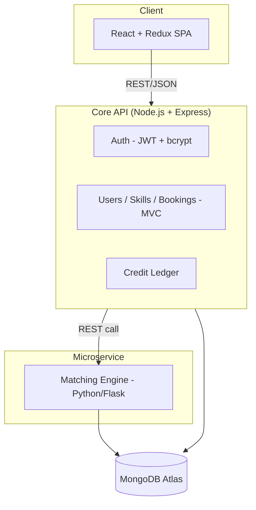

# SkillSwap

A peer-to-peer skill-bartering platform where users trade skills using **time credits** instead of money. Teach an hour of guitar, earn a credit. Spend a credit to learn an hour of Spanish. No cash changes hands.

## Live Demo

- **Frontend:** https://skillswap-rho-five.vercel.app
- **Backend API:** https://skillswap-1-x54c.onrender.com
- **Matching Service:** https://skillswap-vmma.onrender.com

> Note: the backend and matching service run on Render's free tier, which spins down after inactivity. The first request after idle time may take 30–50 seconds to wake up.

## Features

- JWT-based authentication (register/login) with hashed passwords (bcrypt)
- User profiles with "skills offered" and "skills wanted"
- Skill browsing across all users
- Booking workflow: request → accept/decline → complete
- Time-credit ledger with full transaction history
- Recommendation engine (separate Python microservice) suggesting best skill matches
- Role-based authorization on the server (not just hidden UI) — e.g. only the provider can accept a booking; only the requester can mark it complete

## Architecture



**Why this shape:** the Node API is the single gateway the frontend talks to. The Python service is intentionally isolated — it only knows about skill lists and returns match scores, so it could be scaled, redeployed, or rewritten independently of the core app.

## Tech Stack

| Layer | Technology |
|---|---|
| Frontend | React, Redux Toolkit, React Router, Axios, Vite |
| Backend | Node.js, Express, MongoDB (Mongoose) |
| Microservice | Python, Flask |
| Auth | JWT, bcrypt |
| Containers | Docker, Docker Compose |
| CI/CD | GitHub Actions |
| Hosting | Vercel (frontend), Render (backend + microservice), MongoDB Atlas (database) |

## Project Structure

```
skillswap/
├── client/              # React frontend
│   ├── src/
│   │   ├── api/         # Axios instance with auth interceptor
│   │   ├── redux/       # Redux store + auth slice
│   │   ├── pages/       # Login, Register, Dashboard, Browse, Bookings, EditSkills
│   │   └── App.jsx      # Routing
│   └── Dockerfile
├── server/              # Node/Express backend
│   ├── models/          # User, Booking, Transaction (Mongoose schemas)
│   ├── controllers/     # Business logic
│   ├── routes/          # Express route definitions
│   ├── middleware/      # JWT auth middleware
│   ├── server.js
│   └── Dockerfile
├── matching-service/    # Python/Flask microservice
│   ├── app.py
│   └── Dockerfile
├── docker-compose.yml
└── .github/workflows/ci.yml
```

## Running Locally

### Prerequisites
- Node.js 20+
- Python 3.11+
- A free MongoDB Atlas cluster (or local MongoDB)

### Backend
```bash
cd server
npm install
npm run dev
```

### Matching Service
```bash
cd matching-service
python -m venv venv
venv\Scripts\activate        # Windows
source venv/bin/activate     # Mac/Linux
pip install -r requirements.txt
python app.py
```

### Frontend
```bash
cd client
npm install
npm run dev
```

### Environment Variables

`server/.env`
```
MONGO_URI=your_mongodb_connection_string
JWT_SECRET=your_secret_key
PORT=5000
MATCHING_SERVICE_URL=http://localhost:6000
```

`client/.env`
```
VITE_API_URL=http://localhost:5000/api
```

## Running with Docker

```bash
docker compose up --build
```

This starts all three services together. The app will be available at `http://localhost:8080` (frontend), with the backend on `5000` and the matching service on `6000`.

## API Overview

| Method | Endpoint | Description |
|---|---|---|
| POST | `/api/auth/register` | Create a new user |
| POST | `/api/auth/login` | Log in, returns a JWT |
| GET | `/api/users` | List all other users (browse) |
| GET | `/api/users/me` | Get your own profile |
| PUT | `/api/users/me/skills` | Update offered/wanted skills |
| POST | `/api/bookings` | Request a skill swap |
| GET | `/api/bookings` | List your bookings |
| PATCH | `/api/bookings/:id/status` | Accept or decline a booking |
| PATCH | `/api/bookings/:id/complete` | Mark a booking complete, transfer credits |
| GET | `/api/credits/history` | View your credit transaction history |
| GET | `/api/matches` | Get recommended skill matches |

## Testing

Backend tests use Jest + Supertest, covering core auth flows. Run with:
```bash
cd server
npm test
```

## CI/CD

Every push to `main` triggers a GitHub Actions workflow that installs dependencies and builds both the frontend and backend, catching broken builds before they're merged. See `.github/workflows/ci.yml`.

## Known Limitations & Future Improvements

- Credit transfers are sequential writes, not wrapped in a MongoDB atomic transaction — under heavy concurrent load there's a small race-condition risk.
- No real-time updates; booking status changes require a manual refresh (a good candidate for WebSockets).
- The matching algorithm is simple set-overlap; a future version could weight by availability, location, or user rating.
- Free-tier hosting introduces cold-start delays; a production deployment would use always-on instances.

## Author

Built by Mahdi Hasan.
