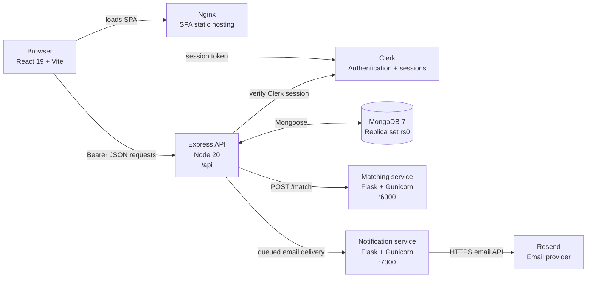
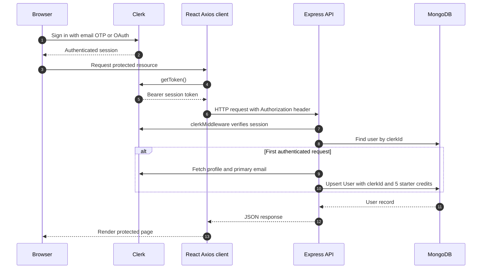
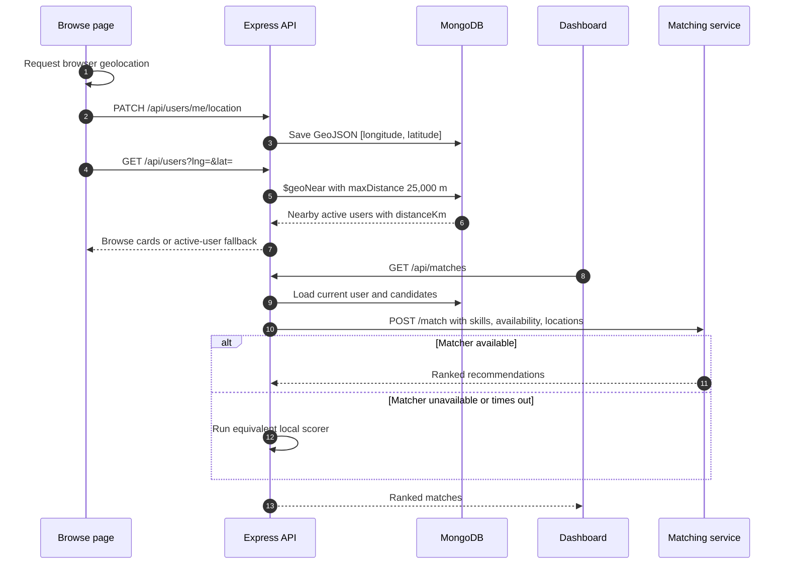
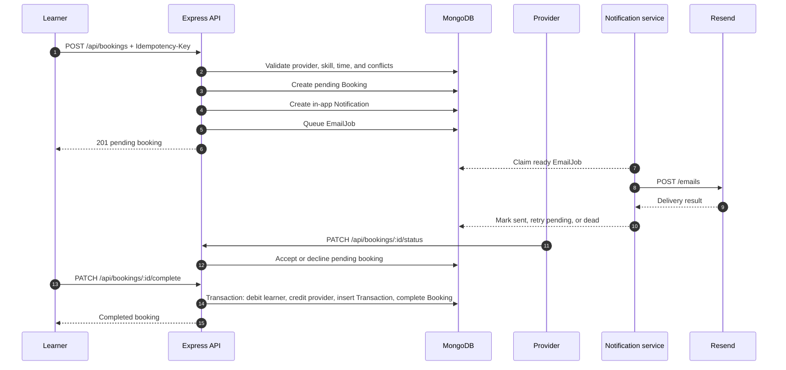
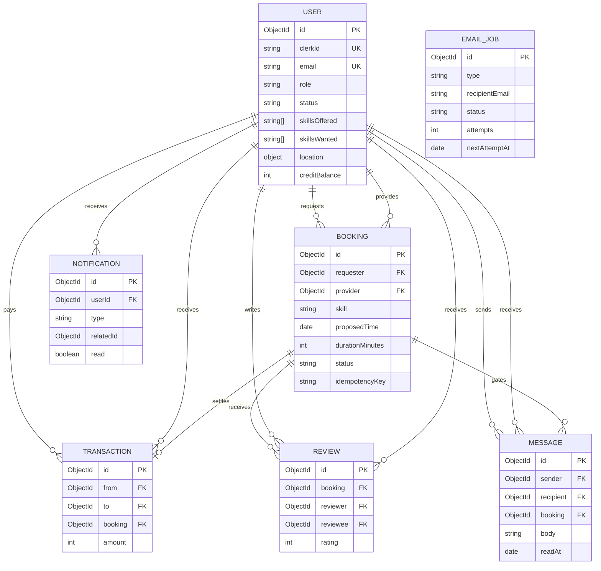

# SkillSwap

SkillSwap is a peer-to-peer skill-exchange platform. Members maintain skills they can teach and skills they want to learn, discover nearby members, request exchanges, message booking partners, transfer time credits when an exchange is completed, and leave reviews.

## Architecture

### Runtime topology



| Component | Directory | Technology | Port |
|---|---|---|---:|
| Web client | `client/` | React 19, Vite, React Router, Redux Toolkit, Clerk | 5173 |
| API | `server/` | Node 20, Express 5, Mongoose, Clerk middleware | 5000 |
| Matching | `matching-service/` | Python 3.11, Flask, Gunicorn | 6000 |
| Notifications | `notification-service/` | Python 3.11, Flask, Gunicorn, Resend API | 7000 |
| Database | Docker/Atlas | MongoDB 7 replica set | 27017 |

MongoDB must support replica-set transactions because booking completion transfers credits and writes several documents atomically.

### Authentication lifecycle



Clerk is the active identity provider. The API middleware attaches `req.userId`, `req.userRole`, `req.clerkUserId`, and `req.user`, and rejects suspended users. The client mounts `BrowserRouter` above `ClerkProvider` and passes React Router navigation callbacks into Clerk.

### Discovery and matching



The match score is `skill overlap + 0.25 availability overlap + 0.25 location match`. When both locations have valid two-number coordinate arrays, the matcher uses the haversine formula and a 25 km limit. If either side lacks valid coordinates, it falls back to case-insensitive city equality. Coordinates are always GeoJSON `[longitude, latitude]`. Reasons are `Within 25km` or `Same location` respectively.

### Booking, credits, notifications, and email



## Features

- Clerk email OTP and OAuth authentication.
- First-login profile provisioning and skills onboarding.
- Five starting time credits for new profiles.
- Skill, availability, and 25 km coordinate-aware matching.
- Browse discovery using MongoDB `$geoNear` with a safe active-user fallback.
- Booking idempotency and overlap/conflict protection.
- Atomic one-credit transfer when a booking is completed.
- Booking-gated messaging, in-app notifications, and reviews.
- Admin analytics, review moderation, and user suspension controls.
- Durable booking email jobs with retries, backoff, dead status, and TTL cleanup.

## Repository structure

```text
skillswap/
├── client/
│   ├── src/api/              Axios client and Clerk token injection
│   ├── src/components/       App shell, auth, onboarding, icons
│   ├── src/pages/            Landing, auth, dashboard, browse, bookings, messages, admin
│   ├── src/redux/            Auth and notification state
│   ├── Dockerfile             Vite build served by Nginx
│   └── nginx.conf              SPA fallback routing
├── server/
│   ├── app.js                 Express middleware, route mounting, health endpoint
│   ├── server.js              MongoDB connection and HTTP bootstrap
│   ├── controllers/           API handlers and business rules
│   ├── middleware/            Clerk authentication and admin authorization
│   ├── models/                Mongoose schemas and indexes
│   ├── routes/                `/api` route modules
│   ├── services/              Email queue worker and notification integration
│   ├── scripts/               Admin and maintenance commands
│   └── tests/                 Jest tests
├── matching-service/          Flask scoring service and unittest suite
├── notification-service/      Authenticated Flask/Resend email service
├── docker-compose.yml         Local orchestration
├── .github/workflows/ci.yml   Node, Python, frontend, and Compose checks
└── README.md
```

Generated dependencies, build output, virtual environments, caches, binaries, and local `.env` files are not application source and should not be committed.

## Data model



Important indexes and invariants:

- `User.location` has a sparse `2dsphere` index.
- `Booking(requester, idempotencyKey)` is unique when an idempotency key exists.
- Booking conflict queries cover both participants and pending/accepted time ranges.
- `Transaction.booking` is unique, preventing duplicate credit settlement.
- `Review(booking, reviewer)` is unique, preventing duplicate reviews by one participant.
- Notifications expire after 90 days; email jobs expire at `expiresAt`.

## API reference

The API is mounted under `/api`. Protected routes require a Clerk session token. Express also applies Helmet, CORS allowlisting, a 100 KB JSON limit, and a 15-minute/20-request authentication rate limiter.

### Public and compatibility endpoints

| Method | Path | Purpose |
|---|---|---|
| `GET` | `/` | API status text |
| `GET` | `/health` | Database-aware health (`200` or `503`) |
| `POST` | `/api/auth/logout` | Protected compatibility logout endpoint |

### Users and discovery

| Method | Path | Purpose |
|---|---|---|
| `GET` | `/api/users/me` | Current profile |
| `PUT` | `/api/users/me` | Complete profile update |
| `PUT` | `/api/users/me/skills` | Update wanted/offered skills |
| `PUT` | `/api/users/me/profile` | Update profile fields |
| `PATCH` | `/api/users/me/location` | Save browser coordinates |
| `GET` | `/api/users?lng=&lat=` | Browse active users, preferring 25 km GeoNear results |
| `GET` | `/api/matches` | Ranked recommendations |

### Exchanges

| Method | Path | Purpose |
|---|---|---|
| `GET` | `/api/bookings` | Current user’s paginated bookings |
| `POST` | `/api/bookings` | Create request; requires `Idempotency-Key` |
| `PATCH` | `/api/bookings/:id/status` | Provider accepts or declines |
| `PATCH` | `/api/bookings/:id/complete` | Requester completes and transfers one credit |
| `GET` | `/api/credits/history` | Credit transactions |
| `POST` | `/api/reviews` | Review a completed booking |
| `GET` | `/api/reviews/mine` | Current user’s reviewable bookings |
| `GET` | `/api/reviews/:userId` | Reviews for a user |
| `GET` | `/api/reviews/user/:userId` | Backwards-compatible review alias |
| `GET` | `/api/messages/unread` | Unread message count |
| `GET` | `/api/messages/:userId` | Booking-gated conversation |
| `POST` | `/api/messages/:userId` | Send booking-gated message |

### Notifications and administration

| Method | Path | Purpose |
|---|---|---|
| `GET` | `/api/notifications` | Current user’s notifications |
| `GET` | `/api/notifications/unread-count` | Unread counts by type |
| `PATCH` | `/api/notifications/:id/read` | Mark one notification read |
| `PATCH` | `/api/notifications/read` | Mark a notification type/all read |
| `GET` | `/api/admin/stats` | Platform counters |
| `GET` | `/api/admin/users` | Moderation list |
| `PATCH` | `/api/admin/users/:id/status` | Suspend or restore a user |
| `DELETE` | `/api/admin/reviews/:id` | Delete a review |

## Frontend routes

| Route | Access | Page |
|---|---|---|
| `/` | Public | Landing page |
| `/login/*` | Public | Clerk sign-in |
| `/register/*` | Public | Clerk sign-up |
| `/dashboard` | Protected | Recommendations and activity |
| `/browse` | Protected | Location-aware member discovery |
| `/bookings` | Protected | Booking workflow and reviews |
| `/messages` | Protected | Booking-gated messages |
| `/edit-skills` | Protected | Profile, skills, location, availability |
| `/credits` | Protected | Credit history |
| `/admin` | Admin | Platform moderation and statistics |

## Local development

### Prerequisites

- Node.js 20 or newer
- Python 3.11 or newer
- MongoDB 6+ with replica-set support, or MongoDB Atlas
- Clerk publishable and secret keys
- Resend account and verified sender for real email delivery

### Start with Docker Compose

```bash
docker compose up --build
```

Default addresses: client `http://localhost:8080`, API `http://localhost:5000`, matcher `http://localhost:6000`, notifications `http://localhost:7000`, and MongoDB `localhost:27017`.

### Run services separately

API:

```bash
cd server
npm install
cp .env.example .env
npm run dev
```

Client:

```bash
cd client
npm install
cp .env.example .env.local
npm run dev
```

Matching service:

```bash
cd matching-service
python -m venv venv
# Windows PowerShell: .\venv\Scripts\Activate.ps1
# macOS/Linux: source venv/bin/activate
pip install -r requirements.txt
python app.py
```

Notification service:

```bash
cd notification-service
python -m venv venv
# Windows PowerShell: .\venv\Scripts\Activate.ps1
# macOS/Linux: source venv/bin/activate
pip install -r requirements.txt
cp .env.example .env
python app.py
```

For a manual MongoDB replica set, start `mongod --replSet rs0 --dbpath /path/to/data`, connect with `mongosh`, and run `rs.initiate()` once. The API connection string should include `?replicaSet=rs0`.

## Environment variables

### Client: `client/.env.local`

| Variable | Required | Description |
|---|---:|---|
| `VITE_API_URL` | Yes outside local defaults | API base URL, normally ending in `/api` |
| `VITE_CLERK_PUBLISHABLE_KEY` | Yes | Clerk browser publishable key |

### API: `server/.env`

| Variable | Required | Description |
|---|---:|---|
| `MONGO_URI` | Yes | MongoDB replica-set connection string |
| `CLERK_SECRET_KEY` | Yes | Clerk server verification secret |
| `PORT` | No | Defaults to `5000` |
| `CLIENT_ORIGINS` | No | Comma-separated allowed browser origins |
| `MATCHING_SERVICE_URL` | No | Defaults to `http://localhost:6000` |
| `MATCHING_SERVICE_TIMEOUT_MS` | No | Matcher timeout; defaults to `60000` |
| `NOTIFICATION_SERVICE_URL` | No | Notification service base URL |
| `NOTIFICATION_SERVICE_API_KEY` | No | Shared API-to-service secret |
| `NOTIFICATION_SERVICE_TIMEOUT_MS` | No | Defaults to `10000` |
| `EMAIL_WORKER_INTERVAL_MS` | No | Queue polling interval; defaults to `5000` |
| `TRUST_PROXY_HOPS` | No | Express proxy trust setting |
| `BLOCKED_EMAIL_DOMAINS` | Legacy/optional | Retained for older auth configuration |

### Notification service: `notification-service/.env`

| Variable | Required | Description |
|---|---:|---|
| `RESEND_API_KEY` | For delivery | Resend API key |
| `EMAIL_FROM` | For delivery | Verified sender identity |
| `NOTIFICATION_SERVICE_API_KEY` | Yes | Must match the API secret |
| `PORT` | No | Defaults to `7000` |

Never commit `.env`, `.env.local`, Clerk secret keys, database credentials, or Resend keys. `VITE_*` values are compiled into browser assets; only the Clerk publishable key belongs there.

## Security and reliability

- Clerk is the source of authentication truth; MongoDB stores application profile and role data.
- Missing/invalid sessions and suspended users are rejected before protected handlers run.
- CORS is allowlisted, credentials are enabled, Helmet is enabled, and request JSON is capped at 100 KB.
- Booking creation requires an 8–100 character idempotency key and has a matching unique database constraint.
- Providers can update only their own pending bookings; requesters alone can complete accepted bookings.
- Completion updates credits, transaction, and booking status inside one MongoDB transaction.
- Messaging requires a valid booking connection and rejects invalid IDs and self-messaging.
- The notification service uses constant-time shared-key comparison on `X-Notification-Key`.
- Clerk owns verification email; the application queue handles booking lifecycle messages only.
- Matching failure is isolated by the local equivalent scorer; email failure is asynchronous and retried.
- Remove temporary authentication debug logging from `server/app.js`, `server/middleware/authMiddleware.js`, and `client/src/api/axios.js` before production.

## Testing and checks

These are the checks run by CI:

```bash
cd server
npm ci
npm test

cd ../client
npm ci
npm run lint
npm run build

cd ../matching-service
python -m pip install -r requirements.txt
python -m unittest -v

cd ../notification-service
python -m pip install -r requirements.txt
python -m unittest -v

cd ..
docker compose config
```

The matcher tests cover availability overlap, the `/match` contract, invalid candidates, coordinates within 25 km, coordinates beyond 25 km despite equal city names, and city fallback when coordinates are missing. Jest covers authentication, admin protection, booking validation/creation, matcher fallback, messaging validation, and notification integration. Notification tests cover health, service-key enforcement, and missing provider configuration.

## Operational commands

Promote a user to admin:

```bash
cd server
node scripts/makeAdmin.js user@example.com
```

Remove legacy email-verification fields and jobs:

```bash
npm run migrate:remove-email-verification
```

## Deployment notes

- Deploy `client` as a static Vite/Nginx site with `VITE_API_URL` and `VITE_CLERK_PUBLISHABLE_KEY` set at build time.
- Deploy `server` with `npm ci` and `node server.js`; provide MongoDB, Clerk, CORS, matcher, and notification configuration.
- Deploy both Flask services with their Dockerfiles or Gunicorn.
- Use MongoDB Atlas or another real replica set in production; a standalone MongoDB cannot support completion transactions.
- Configure Clerk redirect URLs and allowed origins for the deployed client.
- Use a verified Resend sender and separate, randomly generated service secrets.

## Attribution

SkillSwap is maintained by [Mahdi Hasan](https://github.com/eeemrann).
