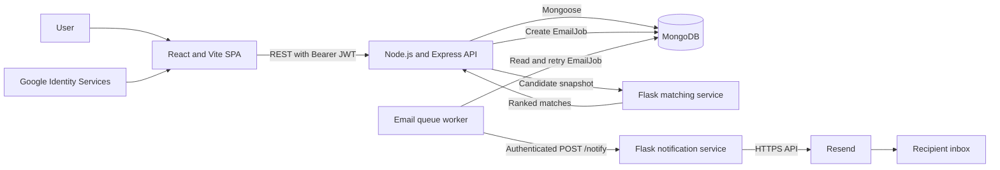
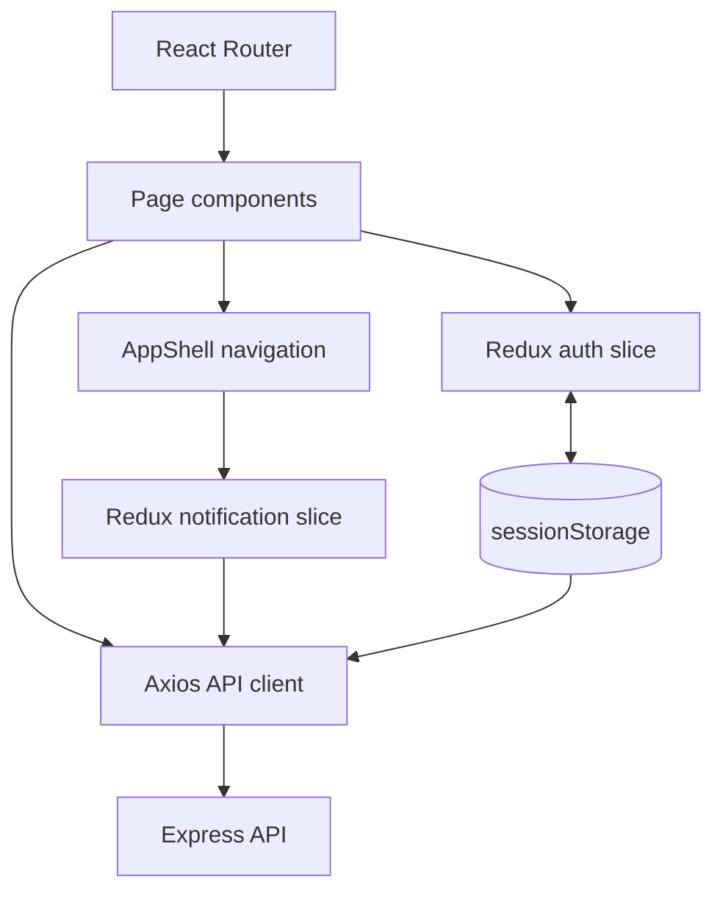
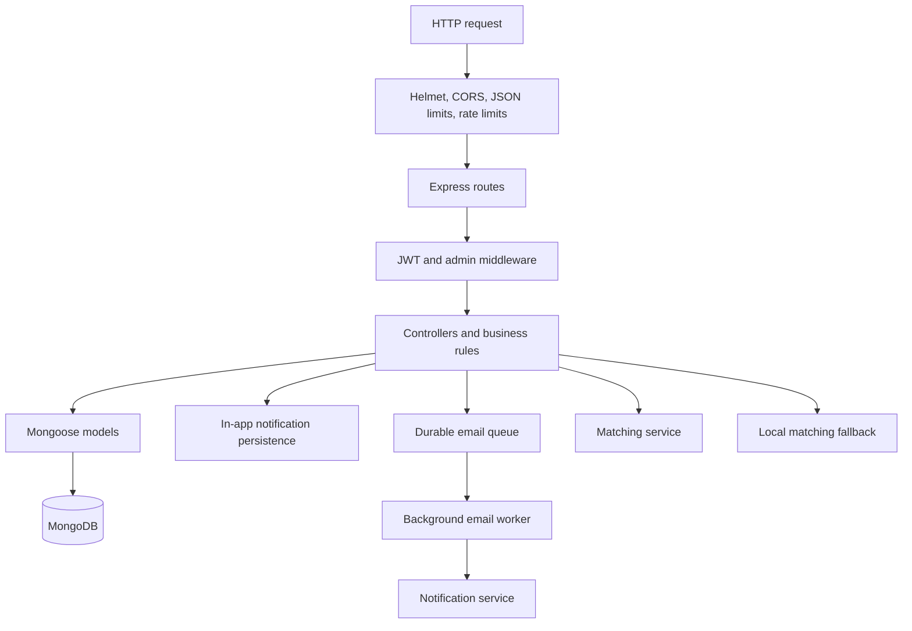
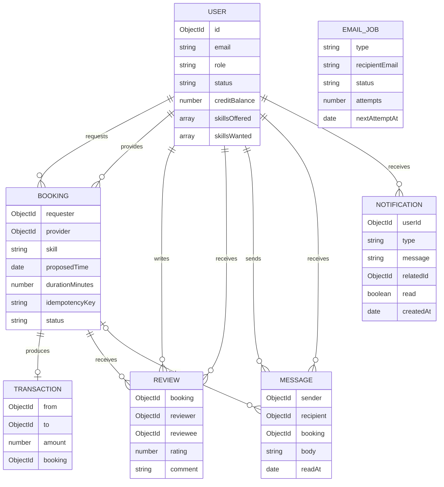
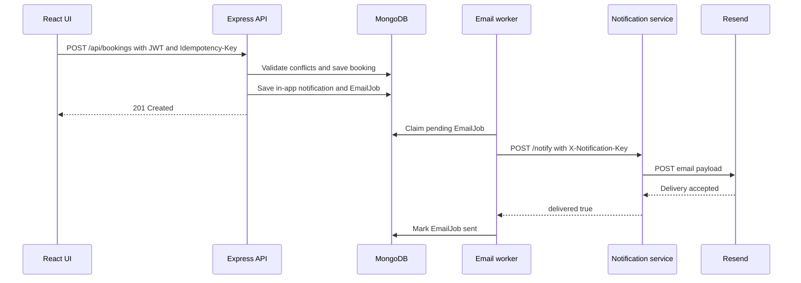

# SkillSwap

SkillSwap is a peer-to-peer learning platform where members teach skills, learn from one another, and exchange time credits instead of money.

## Live services

| Service | URL | Host |
|---|---|---|
| Frontend | [skillswap-rho-five.vercel.app](https://skillswap-rho-five.vercel.app) | Vercel |
| Main API | [skillswap-1-x54c.onrender.com](https://skillswap-1-x54c.onrender.com) | Render |
| Matching service | [skillswap-vmma.onrender.com](https://skillswap-vmma.onrender.com) | Render |
| Notification service | [skillswap-2-vtzd.onrender.com](https://skillswap-2-vtzd.onrender.com/) | Render |

Render services may need time to wake after inactivity.

## Features

- Immediate email/password registration
- Google authentication and JWT-protected APIs
- Profiles containing offered and wanted skills, biography, location, timezone, and availability
- Skill discovery with average ratings and detailed reviews
- Remote matching with a local fallback
- Booking lifecycle: `pending` → `accepted` or `declined` → `completed`
- Transactional time-credit transfers
- Messaging between accepted or completed booking participants
- In-app booking, message, review, and credit notifications
- Booking-event emails through a protected notification service and Resend
- Administrative statistics, account suspension, and review removal
- Docker Compose development environment and GitHub Actions CI

## Architecture

The React application communicates only with the Express API. The API owns authentication and business rules, persists application state in MongoDB, calls the optional matching service, and queues email jobs for the notification service.

### System architecture



### Frontend architecture



Redux is used for cross-page authentication and notification state. Bookings, messages, reviews, profiles, transactions, and recommendations use page-local state.

### Backend architecture



`server/app.js` configures middleware and routes. `server/server.js` connects MongoDB, starts the email worker, starts the HTTP listener, and handles graceful shutdown.

### Component responsibilities

| Component | Responsibility |
|---|---|
| React SPA | Routing, forms, page feedback, auth state, notification badges, and API requests |
| Express API | Authentication, authorization, validation, bookings, credits, messages, reviews, notifications, and administration |
| MongoDB | Users, bookings, transactions, reviews, messages, in-app notifications, and email jobs |
| Matching service | Stateless skill, availability, and location scoring |
| Notification service | Booking-email templates and Resend delivery |
| Email worker | Durable delivery attempts, exponential backoff, and terminal-failure logging |

### Data model



## Important workflows

### Registration and login

1. The browser sends an email and password to `/api/auth/register`.
2. The API validates the email syntax, mail domain, disposable-domain policy, name, and password length.
3. The password is hashed with bcrypt and the user is stored.
4. The API immediately returns a JWT and public user data.
5. The frontend stores the session in `sessionStorage` and opens the dashboard.

There is no email verification code or verification gate.

### Booking and email notifications



Failed email jobs are retried with exponential backoff. Booking requests do not wait for the external email provider.

### Booking completion and credits

Booking completion runs in a MongoDB transaction. It verifies the requester, booking status, and credit balance; subtracts one credit from the requester; adds one to the provider; writes a unique transaction record; and marks the booking completed.

MongoDB must run as a replica set for this transaction.

### Reviews

Only booking participants can review a completed booking. A `{ booking, reviewer }` unique constraint prevents duplicate reviews. Review responses include:

- Average rating
- Total review count
- Rating
- Comment
- Reviewer name and profile picture
- Review date

### Messages and unread notifications

Messages require an accepted or completed booking relationship. If a message includes a booking ID, the API verifies that the booking belongs to both conversation participants. Opening a conversation marks its incoming messages and their related notifications as read.

The application refreshes notification counts every 15 seconds while visible and when the window regains focus.

### Matching

Candidates receive:

- `+1` for every wanted skill they offer
- `+0.25` when availability ranges overlap on the same day
- `+0.25` when both members have the same city

If the Python service fails or times out, the Express API uses the equivalent local matcher.

## Repository structure

```text
skillswap/
├── client/                 React, Vite, Redux, and Nginx configuration
├── server/                 Express API, Mongoose models, tests, and scripts
├── matching-service/       Stateless Flask recommendation service
├── notification-service/   Flask and Resend email service
├── .github/workflows/      Continuous-integration workflow
├── docker-compose.yml      Local multi-service environment
├── CODEBASE.txt            Generated source-code bundle
└── README.md
```

## Technology stack

| Layer | Technology |
|---|---|
| Frontend | React 19, React Router 7, Redux Toolkit, Axios, Vite 8 |
| API | Node.js, Express 5, Mongoose 8 |
| Database | MongoDB or MongoDB Atlas |
| Authentication | JWT, bcryptjs, Google Identity Services |
| Matching | Python, Flask, Gunicorn |
| Email | Python, Flask, Requests, Resend |
| Testing | Jest, Supertest, Python unittest, ESLint, Vite build |
| Deployment | Vercel, Render, Docker, Nginx |

## Local development

### Prerequisites

- Node.js 20 or newer
- Python 3.11 or newer
- Docker and Docker Compose, or a MongoDB replica set
- A Resend API key for real email delivery

### Docker Compose

Create a root `.env`, then run:

```bash
docker compose up --build
```

Local endpoints:

| Service | URL |
|---|---|
| Frontend | `http://localhost:8080` |
| API | `http://localhost:5000` |
| Matching | `http://localhost:6000` |
| Notification | `http://localhost:7000` |

Docker Compose starts MongoDB as a single-node replica set so booking-completion transactions work locally.

### Run services individually

Main API:

```bash
cd server
npm install
cp .env.example .env
npm run dev
```

Frontend:

```bash
cd client
npm install
cp .env.example .env.local
npm run dev
```

Python services:

```bash
cd matching-service
python -m venv venv
# Windows: venv\Scripts\activate
# macOS/Linux: source venv/bin/activate
pip install -r requirements.txt
python app.py
```

Repeat from `notification-service`, including copying `.env.example` to `.env`.

## Environment variables

### Express API

| Variable | Required | Purpose |
|---|---:|---|
| `MONGO_URI` | Yes | MongoDB replica-set or Atlas connection string |
| `JWT_SECRET` | Yes | JWT signing secret |
| `JWT_EXPIRES_IN` | No | JWT lifetime; defaults to `1h` |
| `GOOGLE_CLIENT_ID` | For Google login | Expected Google token audience |
| `PORT` | No | HTTP port; defaults to `5000` |
| `MATCHING_SERVICE_URL` | No | Matching-service base URL |
| `MATCHING_SERVICE_TIMEOUT_MS` | No | Matching request timeout |
| `NOTIFICATION_SERVICE_URL` | For booking email | Notification-service base URL |
| `NOTIFICATION_SERVICE_TIMEOUT_MS` | No | Email-service request timeout |
| `NOTIFICATION_SERVICE_API_KEY` | For booking email | Shared service-to-service secret |
| `CLIENT_ORIGINS` | Recommended | Comma-separated CORS origins |
| `TRUST_PROXY_HOPS` | On Render | Trusted reverse-proxy count; use `1` |
| `BLOCKED_EMAIL_DOMAINS` | No | Additional comma-separated disposable domains |

Production example:

```env
NOTIFICATION_SERVICE_URL=https://skillswap-2-vtzd.onrender.com/
NOTIFICATION_SERVICE_API_KEY=replace-with-a-long-random-shared-secret
CLIENT_ORIGINS=https://skillswap-rho-five.vercel.app
TRUST_PROXY_HOPS=1
```

Do not append `/notify` to `NOTIFICATION_SERVICE_URL`; the API adds it.

### Notification service

| Variable | Required | Purpose |
|---|---:|---|
| `PORT` | No | Flask/Gunicorn port; Render supplies it |
| `RESEND_API_KEY` | Yes | Resend API credential |
| `EMAIL_FROM` | Yes | Resend-verified sender address |
| `NOTIFICATION_SERVICE_API_KEY` | Yes | Must match the Express API value |

Example:

```env
RESEND_API_KEY=re_replace_with_real_key
EMAIL_FROM=SkillSwap <notifications@your-verified-domain.com>
NOTIFICATION_SERVICE_API_KEY=replace-with-the-same-shared-secret
```

### Frontend

| Variable | Required | Purpose |
|---|---:|---|
| `VITE_API_URL` | Recommended | API URL embedded during the Vite build |
| `VITE_GOOGLE_CLIENT_ID` | For Google login | Browser Google OAuth client ID |

Production value:

```env
VITE_API_URL=https://skillswap-1-x54c.onrender.com/api
```

Vite variables are compiled into the client bundle, so changing them requires a frontend rebuild.

## API reference

All application routes except registration, login, and Google authentication require a Bearer JWT.

### Authentication

| Method | Route | Purpose |
|---|---|---|
| `POST` | `/api/auth/register` | Create an account and immediately return a JWT |
| `POST` | `/api/auth/login` | Authenticate and return a JWT |
| `POST` | `/api/auth/google` | Authenticate or register with a Google ID token |
| `POST` | `/api/auth/logout` | Revoke the current token version |

Authentication routes are limited to 20 requests per 15 minutes.

### Users

| Method | Route | Purpose |
|---|---|---|
| `GET` | `/api/users` | Browse non-suspended users with aggregate ratings |
| `GET` | `/api/users/me` | Load the authenticated profile |
| `PUT` | `/api/users/me` | Atomically replace profile details and skills |
| `PUT` | `/api/users/me/skills` | Backward-compatible skills update |
| `PUT` | `/api/users/me/profile` | Backward-compatible profile update |

### Bookings

| Method | Route | Purpose |
|---|---|---|
| `POST` | `/api/bookings` | Create a booking; requires `Idempotency-Key` |
| `GET` | `/api/bookings` | List the current user's bookings |
| `PATCH` | `/api/bookings/:id/status` | Accept or decline a pending booking |
| `PATCH` | `/api/bookings/:id/complete` | Complete a booking and transfer one credit |

### Reviews

| Method | Route | Purpose |
|---|---|---|
| `POST` | `/api/reviews` | Review a completed booking |
| `GET` | `/api/reviews/mine` | Return booking IDs reviewed by the current user |
| `GET` | `/api/reviews/:userId` | Return rating summary and populated reviews |
| `GET` | `/api/reviews/user/:userId` | Backward-compatible review alias |

### Messages

| Method | Route | Purpose |
|---|---|---|
| `GET` | `/api/messages/unread` | Count unread messages |
| `GET` | `/api/messages/:userId` | Load a conversation and mark incoming messages read |
| `POST` | `/api/messages/:userId` | Send a message to a booking connection |

### Notifications

| Method | Route | Purpose |
|---|---|---|
| `GET` | `/api/notifications` | Return paginated recent notifications |
| `GET` | `/api/notifications/unread-count` | Return total and per-type unread counts |
| `PATCH` | `/api/notifications/:id/read` | Mark one notification read |
| `PATCH` | `/api/notifications/read` | Mark all or one notification type read |

Notification types are `booking`, `message`, `review`, and `credit`. Notification documents expire after 90 days.

### Credits, matching, and administration

| Method | Route | Purpose |
|---|---|---|
| `GET` | `/api/credits/history` | Return the current user's credit ledger |
| `GET` | `/api/matches` | Return remote or local recommendations |
| `GET` | `/api/admin/stats` | Return platform totals; admin only |
| `GET` | `/api/admin/users` | List users; admin only |
| `PATCH` | `/api/admin/users/:id/status` | Suspend or restore a user; admin only |
| `DELETE` | `/api/admin/reviews/:id` | Delete a review; admin only |

### Service endpoints

| Service | Method | Route | Purpose |
|---|---|---|---|
| API | `GET` | `/health` | Database-aware readiness response |
| Matching | `GET` | `/` | Health response |
| Matching | `POST` | `/match` | Score supplied candidates |
| Notification | `GET` | `/` | Health response |
| Notification | `POST` | `/notify` | Send a booking email; requires `X-Notification-Key` |

Supported email events are `BOOKING_CREATED`, `BOOKING_ACCEPTED`, `BOOKING_DECLINED`, and `BOOKING_COMPLETED`.

## Testing

```bash
cd server
npm test -- --runInBand

cd ../client
npm run lint
npm run build

cd ../matching-service
python -m unittest -v

cd ../notification-service
python -m unittest -v

cd ..
docker compose config
```

CI uses `npm ci`, runs backend tests, lints and builds the frontend, runs both Python test suites, and validates Docker Compose.

## Deployment

### Vercel frontend

- Root directory: `client`
- Build command: `npm run build`
- Output directory: `dist`
- Configure `VITE_API_URL` and, if enabled, `VITE_GOOGLE_CLIENT_ID`

### Render API

- Root directory: `server`
- Start command: `node server.js`
- Configure MongoDB, JWT, Google, matching, notification, CORS, and proxy variables

### Render matching service

- Root directory: `matching-service`
- Deploy using the included Dockerfile and Gunicorn

### Render notification service

- Root directory: `notification-service`
- Public URL: `https://skillswap-2-vtzd.onrender.com/`
- Deploy using the included Dockerfile and Gunicorn
- Configure `RESEND_API_KEY`, `EMAIL_FROM`, and `NOTIFICATION_SERVICE_API_KEY`
- Use the same `NOTIFICATION_SERVICE_API_KEY` on the Express API

## One-time migration after removing email verification

Email verification is no longer part of SkillSwap. For databases created by older versions, run once from the `server` directory:

```bash
npm run migrate:remove-email-verification
```

This removes obsolete verification fields from users and deletes pending verification email jobs. It does not remove users or booking-notification jobs.

## Security behavior

- Passwords are hashed with bcrypt.
- Local registration authenticates immediately after validation.
- Temporary email domains are rejected, and registration checks for a deliverable mail domain.
- JWTs expire after one hour by default.
- Logout increments the user's token version and invalidates issued tokens.
- Protected requests reload the user's current role and status.
- Helmet security headers and an explicit CORS allowlist are enabled.
- Authentication endpoints are rate-limited behind the configured trusted proxy.
- The notification endpoint requires a timing-safe shared-secret comparison.
- Booking, messaging, review, and administration permissions are enforced server-side.
- Secrets belong in deployment environment variables and must never be committed.

## Current limitations

- Notification badges use polling rather than WebSockets or server-sent events.
- The email queue runs inside the API process rather than a separate worker deployment.
- Matching is intentionally lightweight and uses an in-process fallback.
- Controller validation is not yet consolidated into a single schema-validation library.
- Automated tests emphasize controllers and service boundaries; browser end-to-end coverage is not yet included.

## Author

Mahdi Hasan — [@eeemrann](https://github.com/eeemrann)
