<div align="center">


# SkillSwap

**A SaaS marketplace for live one-to-one tech lessons with verified experts.**<br/>
Learn with credits. Verified lecturers and professionals teach, and cash out their earnings.


<br/>

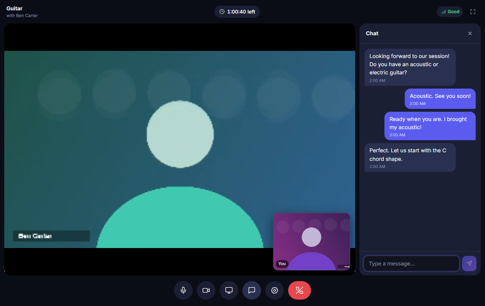

</div>

## The product

SkillSwap is focused on one thing: **technology**. Learners book live one-to-one video sessions in programming, cloud, data and AI, cybersecurity, databases, mobile, games and more with teachers who have been **verified by hand**: university lecturers, industry professionals, certified trainers and independent experts. Every session happens in a **built-in video room** in the browser, with no downloads and no meeting links.

It is a real business, with money flowing in both directions:

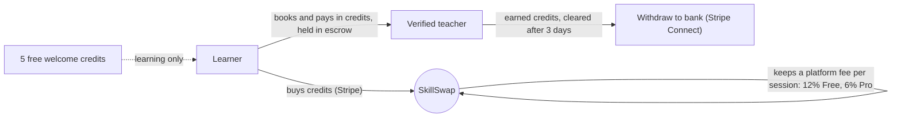
```mermaid
flowchart LR
    learner["Learner"] -->|"buys credits (Stripe)"| platform(("SkillSwap"))
    welcome["5 free welcome credits"] -.->|"learning only"| learner
    learner -->|"books and pays in credits, held in escrow"| teacher["Verified teacher"]
    platform -->|"keeps a platform fee per session: 12% Free, 6% Pro"| platform
    teacher -->|"earned credits, cleared after 3 days"| cash["Withdraw to bank (Stripe Connect)"]
```

- **Learners** get **5 free credits** when they join, then pay by buying credit packs (or a Pro plan). Anyone with credits can learn.
- **Teachers** must apply and be **approved by an administrator** before they can be booked. They set an hourly price in credits, earn credits for every finished session minus a small platform fee, and **cash earned credits out** through Stripe Connect.
- **The platform** earns a fee on every session, the spread between what credits cost and what they cash out for, and Pro subscriptions.

## Screenshots

> Captured before the pivot to a paid, tech-only marketplace. The layout is unchanged, but Discover, Wallet, Admin and the copy have since changed.

<table>
  <tr>
    <td width="50%">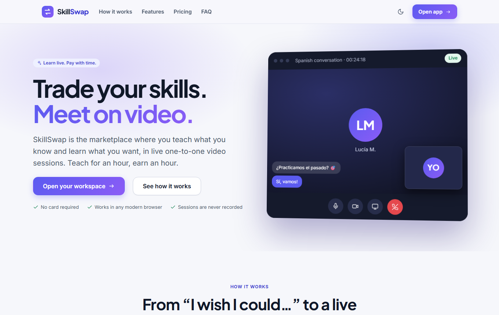<br/><sub><b>Landing</b> · marketing site with live pricing</sub></td>
    <td width="50%">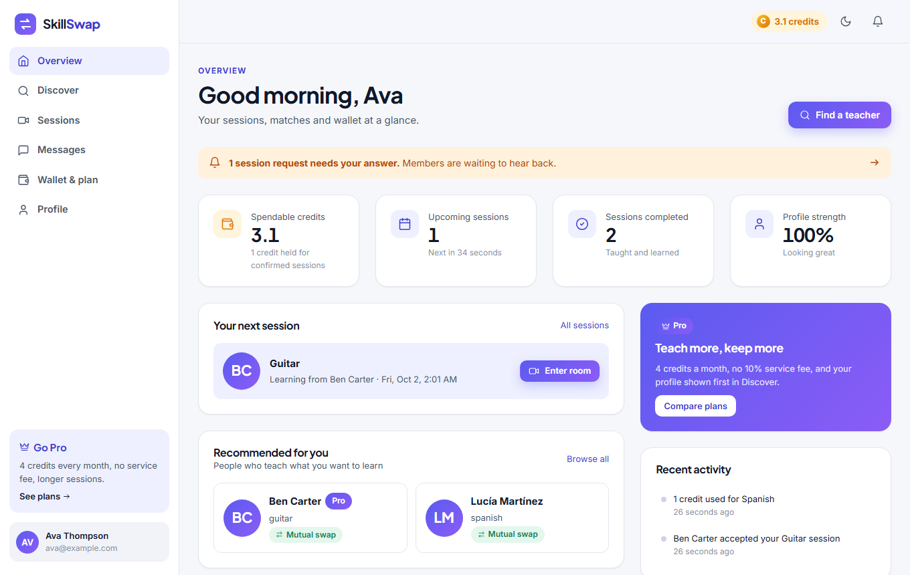<br/><sub><b>Dashboard</b> · next session, matches, wallet</sub></td>
  </tr>
  <tr>
    <td>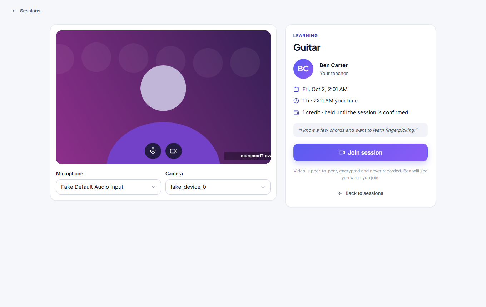<br/><sub><b>Pre-join lobby</b> · camera preview, device pickers</sub></td>
    <td>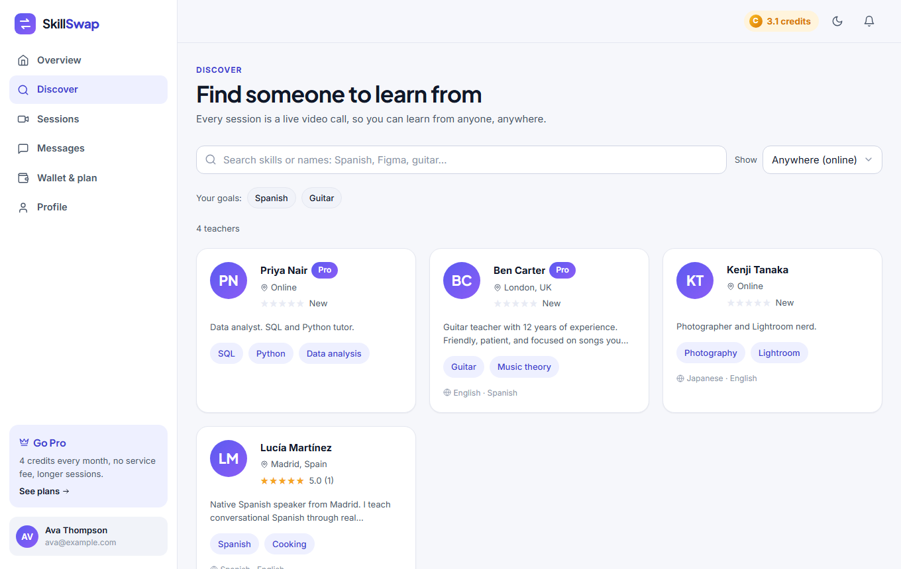<br/><sub><b>Discover</b> · server-side search, Pro placement</sub></td>
  </tr>
  <tr>
    <td>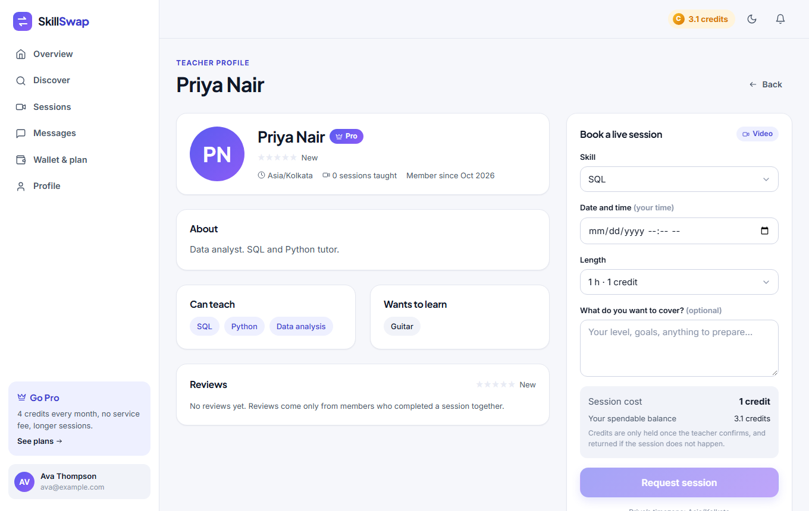<br/><sub><b>Booking</b> · cost, plan limits, teacher's local time</sub></td>
    <td>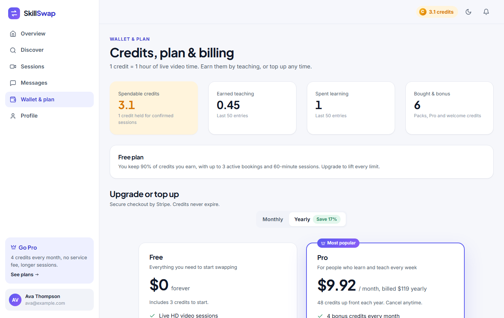<br/><sub><b>Wallet & plan</b> · Stripe checkout, ledger, receipts</sub></td>
  </tr>
  <tr>
    <td>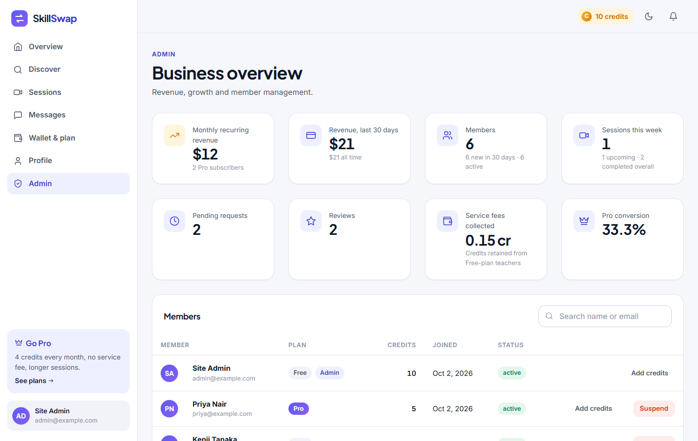<br/><sub><b>Admin</b> · MRR, revenue, member management</sub></td>
    <td>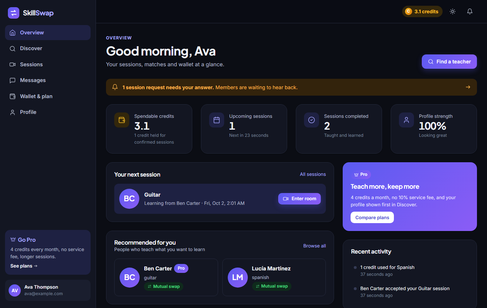<br/><sub><b>Dark theme</b> · and fully responsive (below)</sub></td>
  </tr>
</table>

<div align="center">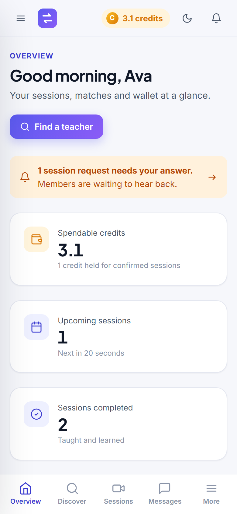</div>

## Feature overview

| | |
| --- | --- |
| **Tech-only catalog** | A closed catalog of ~110 tech skills in 13 categories, enforced by the API. Free-form skills (cooking, guitar…) are rejected everywhere: profiles, applications, search |
| **Verified teachers** | Application with credentials, proof links, years of experience and an optional **university or work mailbox verified by a one-time code**. Hand review by an admin with evidence signals, tiers (Verified / Expert), per-skill approval, revocation that cancels upcoming sessions and refunds learners |
| **Credits as money** | 5 free welcome credits, paid credit packs, Pro plan. Teachers set an hourly price in credits within the cap of their tier. A session costs `rate x hours` |
| **Platform fee** | 12% of a teacher's earnings per session on Free, 6% on Pro, taken when the session settles |
| **Cash-out** | Stripe Connect Express onboarding, minimum withdrawal, 3-day clearing window, automatic transfers with idempotency keys, retries, refunds on failure, admin review for first and large withdrawals |
| **Fraud controls** | Free and bought credits can never be withdrawn (only earned ones), clearing window, first-payout review, risk signals for reviewers, payout holds, automatic hold on chargebacks |
| **Live video** | Peer-to-peer HD video and audio, screen sharing, in-call chat, session timer, connection-quality indicator, device switching, automatic reconnection, TURN relay fallback |
| **Escrow** | Credits are reserved when a teacher confirms and released after the session. No-shows refund automatically; sessions both people attended settle on their own after 24 h |
| **Discovery** | Filter by category, skill, qualification and price, sort by rating or price, timezone-aware availability, optional distance filter, Pro placement |
| **Admin console** | Teacher verification queue, payout approvals, marketplace health (cash in/out, credits outstanding, commission), member management, support credits with an audit trail |
| **Trust & privacy** | Verified-email sign-up, exact location never exposed, credentials shown publicly only as title/issuer/year, data export, account deletion that refuses to destroy withdrawable earnings, rate limiting, signed webhooks |

## Engineering highlights

These are the parts I would want to talk through in an interview.

### 1. A WebRTC engine that survives glare, reloads and bad networks
The video layer is a framework-independent controller (`client/src/lib/call.js`) that React reads through `useSyncExternalStore`. It uses the *perfect negotiation* pattern, ICE restarts, a connection watchdog and live stats sampling.

Testing it properly mattered. A single happy-path run passed, but a **stress test (simultaneous joins and mid-call reloads, in two real Chromium browsers)** exposed that it connected only **2 of 6** times and recovered from a reload **0 of 6** times. Tracing `RTCPeerConnection` showed the polite peer rolling back its own offer and then producing no usable ICE candidates. The fix was to design glare out of the common path: the member already in the room always makes the offer, and the joiner answers first and attaches media afterwards. Result: **16 of 16** rounds.

### 2. Money that cannot be double-spent
Credits are decimals kept exact to two places and every movement is a MongoDB **multi-document transaction**:
- Accepting a booking *reserves* credits; the spendable balance is `balance − held`, so a learner cannot over-commit across several sessions.
- Settlement debits, credits (minus the plan fee), writes the ledger entry and releases the reservation atomically. A **unique index** guarantees one settlement per booking. A test fires three concurrent confirmations and asserts exactly one succeeds.
- A background worker closes anything nobody finished, and never leaves credits stranded in escrow.
- **Only earned credits can be cashed out.** The wallet tracks `earnedCredits` inside the spendable balance; bought, welcome and support credits are spent first so a teacher who also learns keeps as much as possible withdrawable. Earnings clear in first-in-first-out order (`withdrawable = cleared earnings - earned credits already used`), which makes the 3-day chargeback window a single aggregate instead of per-credit bookkeeping.
- **Withdrawals debit the wallet in the same transaction that creates the payout**, so four simultaneous requests for the same credits produce exactly one payout (tested). The Stripe transfer uses the payout id as its idempotency key; temporary failures are retried by a worker, permanent ones refund the credits exactly once.

### 3. Idempotent payments
Stripe webhooks are signature-verified over the raw body. Fulfilment inserts a `Payment` with a unique external id **in the same transaction** as the credit grant, so a redelivered or concurrent event can never grant credits twice. Subscriptions mirror Stripe state (`active`, `past_due`, cancelled) and Pro stays on during payment retries.

### 4. Real-time without a message broker
One authenticated Socket.IO connection carries WebRTC signalling and instant notification and message pushes. The server enforces *who* may be in *which* room and *when*, handles second tabs, records per-person attendance (used for fair settlement), and issues short-lived TURN credentials (HMAC, coturn REST scheme).

### 5. Privacy by design
Public profiles and the directory expose only a city, never coordinates. Booking payloads never include other members' emails or the room secret. Location is opt-in. Search input is regex-escaped; every endpoint is validated. A real bug fixed along the way: the original geo index crashed any profile that had a city but no coordinates, so it became a *partial* 2dsphere index.

### 6. Timezone-correct matching
Availability slots are converted to UTC minutes-of-the-week using each member's timezone (DST-aware) and compared as intervals, including slots that wrap the week boundary. The Python matching service and its JavaScript fallback implement the same scoring, and each is covered by tests for the same cases.

## Architecture

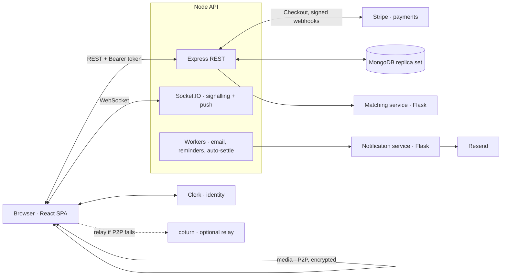
```mermaid
flowchart LR
    browser["Browser · React SPA"]
    clerk["Clerk · identity"]
    stripe["Stripe · payments"]
    subgraph node["Node API"]
        api["Express REST"]
        sockets["Socket.IO · signalling + push"]
        workers["Workers · email, reminders, auto-settle"]
    end
    mongo[("MongoDB replica set")]
    matcher["Matching service · Flask"]
    notifier["Notification service · Flask"]
    resend["Resend"]
    turn["coturn · optional relay"]

    browser <-->|REST + Bearer token| api
    browser <-->|WebSocket| sockets
    browser <-->|"media · P2P, encrypted"| browser
    browser -.->|relay if P2P fails| turn
    browser <--> clerk
    api <--> mongo
    api --> matcher
    workers --> notifier --> resend
    api <-->|Checkout, signed webhooks| stripe
```

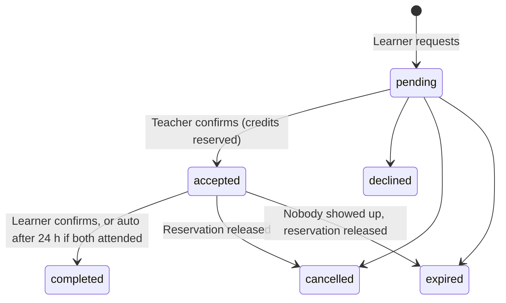
```mermaid
stateDiagram-v2
    [*] --> pending: Learner requests
    pending --> accepted: Teacher confirms (credits reserved)
    pending --> declined
    pending --> cancelled
    pending --> expired
    accepted --> completed: Learner confirms, or auto after 24 h if both attended
    accepted --> cancelled: Reservation released
    accepted --> expired: Nobody showed up, reservation released
```

## Testing

**229 automated tests** across the stack, run in CI on every push.

| Suite | Tests | What it proves |
| --- | --- | --- |
| Booking lifecycle (integration) | 24 | Verified-teacher gate, rate-based pricing, escrow, concurrent settlement, earned-credit accounting, auto-closing, cancellations, against real MongoDB transactions |
| Payouts (integration) | 25 | Clearing window, FIFO earnings, concurrent withdrawals, Stripe failures and retries, idempotency keys, refunds, admin review, first-payout review, fraud signals, Connect onboarding |
| Teacher verification (integration and unit) | 31 | Application and email-code flow, approval with tiers and skill subsets, rejection and re-application, expansion requests, revocation and refunds, rate caps |
| Stripe webhooks (integration) | 14 | Signature checks (checkout and Connect endpoints), replay safety, Pro grants, downgrade, `past_due`, payout account updates, chargeback holds |
| Realtime sockets (integration) | 10 | Auth, access windows, signalling relay, persisted chat, attendance, tab replacement |
| HTTP API (integration) | 29 | Verified-only directory, filters and sorting, privacy of public data, catalog-only skills, bookings and ledger, messaging, account deletion, admin |
| Unit | 67 | Tech catalog, application validation, session windows, ICE credentials, pricing economics (the platform never loses money on a pack), availability math, auth middleware |
| Python services | 29 | Matching, timezone handling, email templating (including teacher and payout emails) and HTML escaping |

Integration suites run on an in-memory MongoDB replica set, so they need no external services. The UI was also exercised end to end in headless Edge against the real API (new member applies, admin approves, learner finds the teacher, teacher withdraws, admin releases a large payout) with no console errors.

## Tech stack

| Layer | Technology |
| --- | --- |
| Frontend | React 19, React Router 7, Redux Toolkit, Vite 8, hand-written design system (light and dark), Socket.IO client, native WebRTC |
| API | Node.js 20, Express 5, Mongoose 8, Socket.IO, `express-rate-limit`, Helmet |
| Data | MongoDB 7 (replica set, transactions, partial 2dsphere and unique indexes, TTL indexes) |
| Auth | Clerk (JWT verified on REST and on the socket handshake) |
| Payments | Stripe Checkout, Billing Portal, webhooks |
| Services | Python 3.11 + Flask: matching and templated HTML email via Resend |
| Infra | Docker Compose, nginx, coturn, GitHub Actions CI |

## Business model

All numbers live in one file, `server/config/plans.js`, and can be overridden with environment variables.

| | Free | Pro |
| --- | --- | --- |
| Price | $0 | $19 / month or $190 / year |
| Welcome credits | 5 (learning only) | plus 1 credit every month |
| Platform fee on teaching earnings | 12 % | 6 % |
| Active bookings | 3 | 25 |
| Session length | up to 60 min | up to 4 h |
| Placement in Discover | standard | priority and Pro badge |

**Credit packs**: 5 credits for $50, 15 for $135, 40 for $340 ($10, $9 and $8.50 per credit). **Teachers cash out at $8 per credit** after the platform fee, from a $20 minimum.

Worked example, a 1-hour session at 2 credits/hour with a Free-plan teacher: the learner spends 2 credits (bought at $9 to $10 each), the teacher earns 1.76 credits and withdraws $14.08, and the platform keeps 0.24 credits of fee plus the spread. At the cheapest pack the platform still keeps about 8% on a Pro teacher's session after Stripe's card fees; a unit test asserts that no pack is ever sold below the cost of paying the teacher out.

**Teacher tiers**: Verified teachers charge up to 3 credits/hour, Experts (set by a reviewer, typically senior lecturers and principal engineers) up to 8.

### How teachers are verified (and why we can pay them)

1. The applicant picks how they qualify (lecturer, professional, certified trainer, independent expert), lists up to ten catalog skills, an hourly price, **credentials with links**, links to LinkedIn, GitHub or a **staff page**, and optionally a **university or work mailbox proven with a one-time code**.
2. A reviewer sees everything with evidence signals (academic domain, mailbox verified, credentials that have a link, link hosts), approves **specific skills**, sets the **tier and price**, or rejects with feedback the applicant sees.
3. Only approved teachers appear in Discover and can be booked. Revoking access cancels upcoming sessions and returns held credits.
4. To be paid, a teacher also completes **Stripe's identity and bank verification** (Connect Express). SkillSwap never handles bank details.
5. Their first withdrawal and any withdrawal above $250 are reviewed by an admin, with a signal showing how much of their income came from learners who never paid for anything.

### Operating it

- **Stripe**: set `STRIPE_SECRET_KEY`, add a webhook endpoint for `checkout.session.completed`, `invoice.paid`, `invoice.payment_failed`, `customer.subscription.*` and `charge.dispute.created` (`STRIPE_WEBHOOK_SECRET`), and a second endpoint for **events on connected accounts** (`account.updated`, `STRIPE_CONNECT_WEBHOOK_SECRET`). Enable Connect, and Stripe Tax if you sell in the EU or UK (`STRIPE_AUTOMATIC_TAX=true`). Turn on Stripe's Adaptive Pricing so international buyers see their own currency.
- **Payout funds**: teachers are paid with Stripe *separate charges and transfers* from your platform balance, so keep it funded. Cross-border transfers depend on the countries Stripe supports for your platform's region.
- **First admin**: `node server/scripts/makeAdmin.js you@example.com`.
- **Existing database?** Run `node server/scripts/migrateToTechMarketplace.js --dry-run`, then without the flag. Balances are kept as learning credits (not withdrawable), non-tech wanted skills are dropped, and old "teachers" must apply and be verified.
- **Known limits**: single currency (USD), no automated refund or dispute-resolution flow beyond holding payouts, credentials are checked by people rather than an ID-verification API, and the legal pages are templates a lawyer must review.

## Repository layout

```
client/                  React SPA
  src/lib/call.js        WebRTC engine (negotiation, reconnection, screen share, stats)
  src/pages/Session.jsx  Lobby, call UI, post-call confirmation
  src/styles/            Design tokens, light/dark themes, responsive layout
server/                  Express API, Socket.IO, background workers
  config/plans.js        Pricing, fees, cash-out rate, teacher rates and plan limits
  config/catalog.js      The closed tech skill catalog
  services/              bookingService (escrow), teacherService (verification), payoutService (cash-out),
                         creditService (wallet), billingService (Stripe), sessionService, workers
  scripts/               makeAdmin, migrateToTechMarketplace
  sockets/               Authenticated signalling and push
  tests/                 Unit and integration suites
matching-service/        Flask: skill, mutual-swap and timezone-aware ranking
notification-service/    Flask: HTML and text email templates
infra/                   coturn configuration
```

<details>
<summary><b>Run it locally</b></summary>

<br/>

Requires Node 20+, Python 3.11+, MongoDB 7 as a replica set, and a Clerk application. Stripe (with Connect for payouts), Resend and TURN are optional in development.

```bash
# API
cd server && cp .env.example .env && npm install && npm run dev
# Web app
cd client && cp .env.example .env && npm install && npm run dev
```

Or run everything with `docker compose up --build` (add `--profile turn` for the TURN relay). All configuration is documented in `server/.env.example`.

```bash
cd server && npm test                      # 200 tests
cd client && npm run lint && npm run build
cd matching-service && python -m unittest
cd notification-service && python -m unittest
```

</details>

---

<div align="center">

Built by [@eeemrann](https://github.com/eeemrann)

</div>
