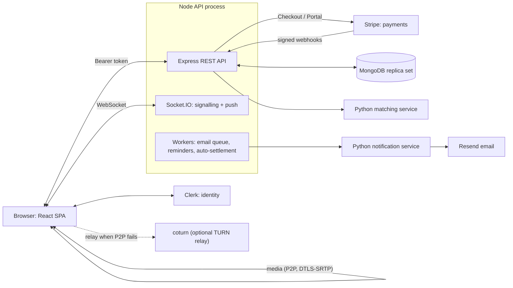
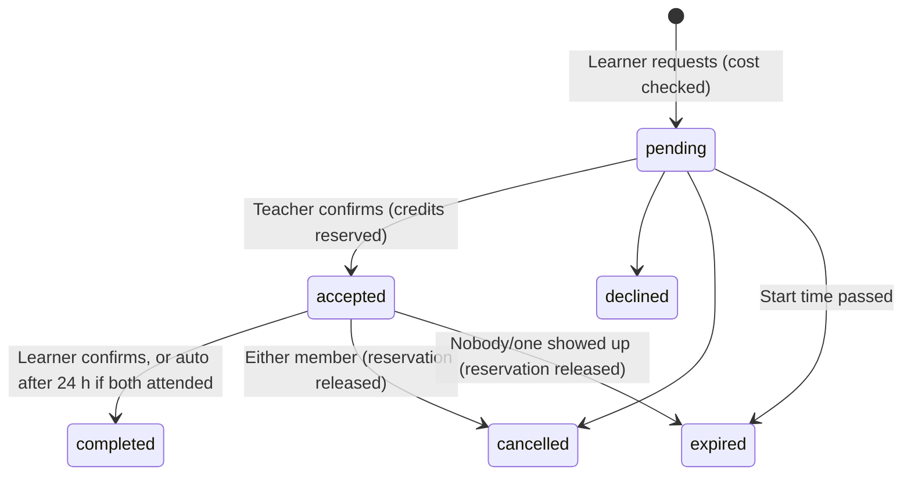

# SkillSwap

SkillSwap is a SaaS marketplace for **live one-to-one video lessons paid in time**. Members teach what they know, learn what they want, and settle up in credits: **1 credit = 1 hour of video time**. Sessions happen inside the app on a built-in WebRTC video room (camera, microphone, screen sharing and chat), so there is nothing to install and no meeting links to juggle.

Location is optional and only used to rank nearby teachers. **Every session is online.**

## What's in the product

| Area | Highlights |
| --- | --- |
| **Live video sessions** | Peer-to-peer HD video/audio, screen share, in-call chat (saved to the conversation), session timer, connection-quality indicator, device switching, pre-join lobby with camera preview, automatic reconnection, TURN fallback |
| **Credits & escrow** | Credits are reserved from the learner when the teacher confirms and released after the session. No-shows are refunded automatically; sessions both members attended settle on their own after 24 h |
| **Monetization** | Free / Pro subscription (monthly or yearly), credit packs, 10 % service fee on credits earned by Free-plan teachers, in-context paywall, Stripe Checkout + customer portal |
| **Discovery & matching** | Server-side search, optional radius filter, Pro placement, mutual-swap bonus, timezone-aware availability overlap, verified reviews |
| **Booking flow** | Request → confirm → join → confirm & pay → review; cancellations, expiries, reminders by email and in-app, idempotent requests |
| **Admin** | MRR, revenue, growth and session metrics, member search, suspend/restore, support credits with audit trail, payments list |
| **Trust & privacy** | Only verified emails receive a profile; exact coordinates are never exposed; data export and account deletion; rate limiting; webhook signature verification |

## Pricing model (configurable in `server/config/plans.js`)

| | Free | Pro |
| --- | --- | --- |
| Price | $0 | $12 / month or $119 / year |
| Starter credits | 3 on sign-up | + 4 credits per month (48 up front on yearly) |
| Service fee on credits you earn | 10 % | 0 % |
| Active bookings | 3 | 25 |
| Session length | up to 60 min | up to 4 h |
| Discover placement | standard | priority + Pro badge |

Credit packs: 3 for $9, 10 for $25, 25 for $55. Credits never expire and cannot be cashed out, which keeps SkillSwap a time-exchange rather than a payments product. Prices, fees and limits live in one file and flow to the API, checkout and marketing pages.

Revenue streams: subscriptions, credit-pack sales and the Free-plan service fee. Pro upsells appear at the moments they matter: an empty wallet, a plan limit, or a longer session.

## Architecture


```mermaid
flowchart LR
    browser["Browser: React SPA"]
    clerk["Clerk: identity"]
    stripe["Stripe: payments"]
    subgraph node["Node API process"]
        api["Express REST API"]
        sockets["Socket.IO: signalling + push"]
        workers["Workers: email queue, reminders, auto-settlement"]
    end
    mongo[("MongoDB replica set")]
    matcher["Python matching service"]
    notifier["Python notification service"]
    resend["Resend email"]
    turn["coturn (optional TURN relay)"]

    browser <-->|Bearer token| api
    browser <-->|WebSocket| sockets
    browser <-->|"media (P2P, DTLS-SRTP)"| browser
    browser -.->|relay when P2P fails| turn
    browser <--> clerk
    api <--> mongo
    api --> matcher
    workers --> notifier --> resend
    api -->|Checkout / Portal| stripe
    stripe -->|signed webhooks| api
```

* **Only the Node API talks to MongoDB.** A replica set is required because booking acceptance, settlement and payment fulfilment are multi-document transactions.
* **Video is peer-to-peer.** The server only relays WebRTC signalling and enforces who may be in which room and when; it never sees media. The room opens 10 minutes before the start and closes 15 minutes after the scheduled end. The offerer is always the member already in the room, so simultaneous offers are avoided, and "perfect negotiation" is kept as a safety net.
* **Realtime** uses a single authenticated Socket.IO connection for signalling and instant notification/message pushes. HTTP polling remains as a slow fallback.
* **Matching** runs in the Python service; the API falls back to an identical JavaScript implementation if it is unavailable.
* A single API instance holds room state in memory. To scale horizontally, add the Socket.IO Redis adapter and sticky sessions.

## Credits, escrow and settlement


```mermaid
stateDiagram-v2
    [*] --> pending: Learner requests (cost checked)
    pending --> accepted: Teacher confirms (credits reserved)
    pending --> declined
    pending --> cancelled
    pending --> expired: Start time passed
    accepted --> completed: Learner confirms, or auto after 24 h if both attended
    accepted --> cancelled: Either member (reservation released)
    accepted --> expired: Nobody/one showed up (reservation released)
```

* Spendable credits = balance − credits reserved for confirmed sessions, so a learner cannot over-commit.
* Settlement moves the credits to the teacher minus the plan fee, writes one ledger entry (a unique index guarantees a booking settles once) and releases the reservation, all in one transaction.
* Stripe webhooks are idempotent: the `Payment` document's unique `externalId` is inserted in the same transaction as the credit grant, so redelivered events can never double-credit.

## Local development

Requirements: Node 20+, Python 3.11+, MongoDB 7 **as a replica set**, a [Clerk](https://clerk.com) application, optionally Stripe and Resend.

```bash
# API
cd server && cp .env.example .env   # fill in MONGO_URI, Clerk keys, ...
npm install && npm run dev

# Web app
cd client && cp .env.example .env   # VITE_CLERK_PUBLISHABLE_KEY, VITE_API_URL
npm install && npm run dev

# Python services (optional locally)
cd matching-service && pip install -r requirements.txt && python app.py
cd notification-service && pip install -r requirements.txt && python app.py
```

Or run everything: `docker compose up --build` (add `--profile turn` for the TURN relay). Make yourself an admin with `node server/scripts/makeAdmin.js you@example.com`.

### Clerk
Create an application, enable the sign-in methods you want, and set `CLERK_PUBLISHABLE_KEY` / `CLERK_SECRET_KEY` on the API and `VITE_CLERK_PUBLISHABLE_KEY` on the client. Require email verification: the API only creates profiles (and grants welcome credits) for verified addresses.

### Stripe
1. Set `STRIPE_SECRET_KEY`. Products and prices are created inline at checkout, so no dashboard setup is needed.
2. Add a webhook endpoint `https://<api>/api/billing/webhook` for `checkout.session.completed`, `invoice.paid`, `invoice.payment_failed` and `customer.subscription.created|updated|deleted`, and set `STRIPE_WEBHOOK_SECRET`.
3. Enable the customer portal in the Stripe dashboard so members can manage cards and cancel.
4. Optional: enable Stripe Tax and set `STRIPE_AUTOMATIC_TAX=true`.

Test locally with `stripe listen --forward-to localhost:5000/api/billing/webhook`.

### TURN (important for production video)
STUN is enough for most connections, but some corporate and mobile networks need a relay. Run coturn (`docker compose --profile turn up`, or any hosted TURN service), then set `TURN_URLS` and either `TURN_SECRET` (short-lived credentials are generated per member) or `TURN_USERNAME` / `TURN_CREDENTIAL`.

## Tests

```bash
cd server && npm test            # 128 tests: unit + integration (real MongoDB transactions, real sockets, signed Stripe webhooks)
cd client && npm run lint && npm run build
cd matching-service && python -m unittest -v
cd notification-service && python -m unittest -v
```

The integration suites use `mongodb-memory-server` replica sets, so no external database is needed. They cover escrow and settlement races, plan limits, webhook idempotency, socket authorization and signalling, privacy of public profiles, and account deletion.

## Before you launch

- [ ] Have a lawyer review `client/src/pages/Legal.jsx` (Terms and Privacy are plain-language templates, including the refund wording) and add a real support contact.
- [ ] Set production values for every variable in `server/.env.example`; use live Clerk and Stripe keys.
- [ ] Deploy TURN and set `TURN_*`; test a session across two different networks.
- [ ] Create the Stripe webhook and test a purchase, a renewal and a cancellation end to end.
- [ ] Verify your sending domain with Resend and set `EMAIL_FROM`.
- [ ] Run behind HTTPS (required for camera access outside localhost).
- [ ] Add error monitoring (e.g. Sentry) and uptime checks on `/health`.
- [ ] Decide your policy on refunds, disputes and reported members; the admin tools support suspension and support credits.

## Project layout

```
client/              React 19 + Vite SPA (pages, components, lib/call.js = WebRTC engine)
server/              Express API, Socket.IO, workers
  config/plans.js    Pricing, fees, limits
  services/          bookingService (escrow lifecycle), billingService (Stripe), sessionService, workers
  sockets/           Authenticated signalling + push
  tests/             Unit + integration suites
matching-service/    Flask: ranking (skills, mutual swap, timezone-aware availability)
notification-service/ Flask: HTML/text emails through Resend
infra/               coturn configuration
```
