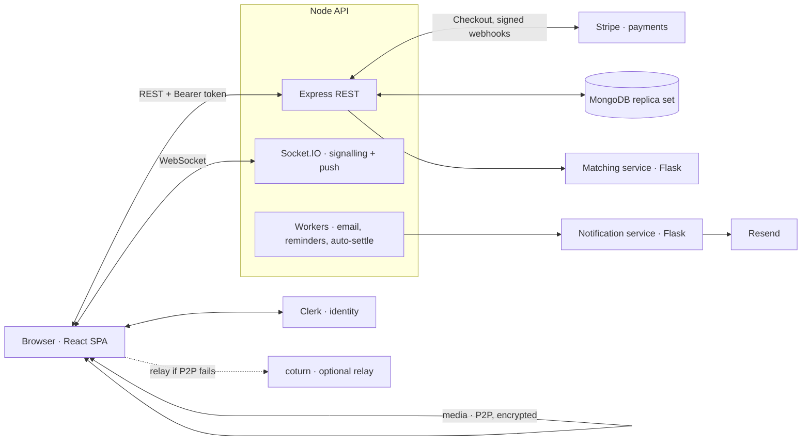
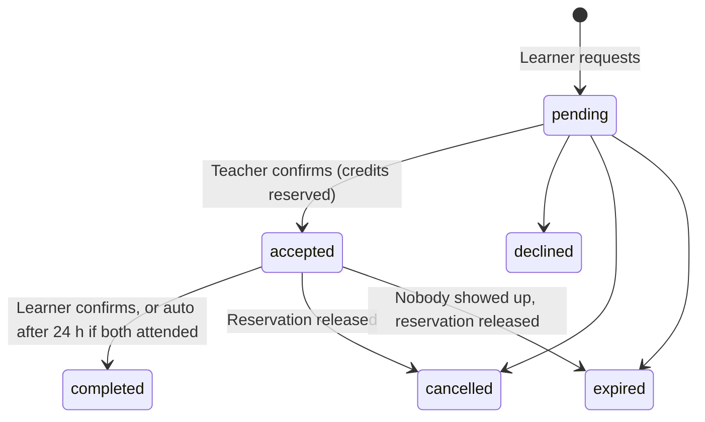

<div align="center">


# SkillSwap

**A SaaS marketplace for live one-to-one video lessons, paid in time.**<br/>
Teach for an hour, earn a credit, spend it learning something new.


<br/>


</div>

## The product

People trade skills instead of money. A designer teaches Figma and earns credits; those credits buy an hour of Spanish from someone else. **1 credit = 1 hour**, and every session happens in a **built-in video room** in the browser, with no downloads and no meeting links.

It is built as a real business, not a demo: subscriptions, credit packs, a service fee, escrow so nobody pays for a session that did not happen, an admin console with revenue metrics, and the privacy and account controls a paying product needs.

## Screenshots

<table>
  <tr>
    <td width="50%"><br/><sub><b>Landing</b> · marketing site with live pricing</sub></td>
    <td width="50%"><br/><sub><b>Dashboard</b> · next session, matches, wallet</sub></td>
  </tr>
  <tr>
    <td><br/><sub><b>Pre-join lobby</b> · camera preview, device pickers</sub></td>
    <td><br/><sub><b>Discover</b> · server-side search, Pro placement</sub></td>
  </tr>
  <tr>
    <td><br/><sub><b>Booking</b> · cost, plan limits, teacher's local time</sub></td>
    <td><br/><sub><b>Wallet & plan</b> · Stripe checkout, ledger, receipts</sub></td>
  </tr>
  <tr>
    <td><br/><sub><b>Admin</b> · MRR, revenue, member management</sub></td>
    <td><br/><sub><b>Dark theme</b> · and fully responsive (below)</sub></td>
  </tr>
</table>

<div align="center"></div>

## Feature overview

| | |
| --- | --- |
| **Live video** | Peer-to-peer HD video and audio, screen sharing, in-call chat, session timer, connection-quality indicator, device switching, automatic reconnection, TURN relay fallback |
| **Credits & escrow** | Credits are reserved when a teacher confirms and released after the session. No-shows refund automatically; sessions both people attended settle on their own after 24 h |
| **Monetization** | Free and Pro plans (monthly or yearly), credit packs, a service fee on Free-plan earnings, an in-context paywall, Stripe Checkout and the customer portal |
| **Matching** | Skill fit, a bonus for true two-way swaps, **timezone-aware** availability overlap, optional distance filter |
| **Bookings** | Request, confirm, join, confirm and pay, review. Cancellations, expiry, email and in-app reminders, idempotent requests |
| **Trust & privacy** | Verified-email sign-up, exact location never exposed, data export, account deletion, rate limiting, signed webhooks |
| **Admin** | MRR and revenue, growth, member search, suspend and restore, support credits with an audit trail |

## Engineering highlights

These are the parts I would want to talk through in an interview.

### 1. A WebRTC engine that survives glare, reloads and bad networks
The video layer is a framework-independent controller (`client/src/lib/call.js`) that React reads through `useSyncExternalStore`. It uses the *perfect negotiation* pattern, ICE restarts, a connection watchdog and live stats sampling.

Testing it properly mattered. A single happy-path run passed, but a **stress test (simultaneous joins and mid-call reloads, in two real Chromium browsers)** exposed that it connected only **2 of 6** times and recovered from a reload **0 of 6** times. Tracing `RTCPeerConnection` showed the polite peer rolling back its own offer and then producing no usable ICE candidates. The fix was to design glare out of the common path: the member already in the room always makes the offer, and the joiner answers first and attaches media afterwards. Result: **16 of 16** rounds.

### 2. Money that cannot be double-spent
Credits are decimal hours, so balances are kept exact to two places and every movement is a MongoDB **multi-document transaction**:
- Accepting a booking *reserves* credits; the spendable balance is `balance − held`, so a learner cannot over-commit across several sessions.
- Settlement debits, credits (minus the plan fee), writes the ledger entry and releases the reservation atomically. A **unique index** guarantees one settlement per booking. A test fires three concurrent confirmations and asserts exactly one succeeds.
- A background worker closes anything nobody finished, and never leaves credits stranded in escrow.

### 3. Idempotent payments
Stripe webhooks are signature-verified over the raw body. Fulfilment inserts a `Payment` with a unique external id **in the same transaction** as the credit grant, so a redelivered or concurrent event can never grant credits twice. Subscriptions mirror Stripe state (`active`, `past_due`, cancelled) and Pro stays on during payment retries.

### 4. Real-time without a message broker
One authenticated Socket.IO connection carries WebRTC signalling and instant notification and message pushes. The server enforces *who* may be in *which* room and *when*, handles second tabs, records per-person attendance (used for fair settlement), and issues short-lived TURN credentials (HMAC, coturn REST scheme).

### 5. Privacy by design
Public profiles and the directory expose only a city, never coordinates. Booking payloads never include other members' emails or the room secret. Location is opt-in. Search input is regex-escaped; every endpoint is validated. A real bug fixed along the way: the original geo index crashed any profile that had a city but no coordinates, so it became a *partial* 2dsphere index.

### 6. Timezone-correct matching
Availability slots are converted to UTC minutes-of-the-week using each member's timezone (DST-aware) and compared as intervals, including slots that wrap the week boundary. The Python matching service and its JavaScript fallback implement the same scoring, and each is covered by tests for the same cases.

## Architecture


```mermaid
flowchart LR
    browser["Browser · React SPA"]
    clerk["Clerk · identity"]
    stripe["Stripe · payments"]
    subgraph node["Node API"]
        api["Express REST"]
        sockets["Socket.IO · signalling + push"]
        workers["Workers · email, reminders, auto-settle"]
    end
    mongo[("MongoDB replica set")]
    matcher["Matching service · Flask"]
    notifier["Notification service · Flask"]
    resend["Resend"]
    turn["coturn · optional relay"]

    browser <-->|REST + Bearer token| api
    browser <-->|WebSocket| sockets
    browser <-->|"media · P2P, encrypted"| browser
    browser -.->|relay if P2P fails| turn
    browser <--> clerk
    api <--> mongo
    api --> matcher
    workers --> notifier --> resend
    api <-->|Checkout, signed webhooks| stripe
```


```mermaid
stateDiagram-v2
    [*] --> pending: Learner requests
    pending --> accepted: Teacher confirms (credits reserved)
    pending --> declined
    pending --> cancelled
    pending --> expired
    accepted --> completed: Learner confirms, or auto after 24 h if both attended
    accepted --> cancelled: Reservation released
    accepted --> expired: Nobody showed up, reservation released
```

## Testing

**153 automated tests** across the stack, run in CI on every push.

| Suite | Tests | What it proves |
| --- | --- | --- |
| Booking lifecycle (integration) | 20 | Escrow, concurrent settlement, plan limits, auto-closing, cancellations, all against real MongoDB transactions |
| Stripe webhooks (integration) | 11 | Signature checks, replay safety, yearly and monthly Pro grants, downgrade, `past_due` |
| Realtime sockets (integration) | 10 | Auth, access windows, signalling relay, persisted chat, attendance, tab replacement |
| HTTP API (integration) | 22 | Directory and geo search, privacy of public data, bookings and ledger, messaging, account deletion, admin |
| Unit | 65 | Session windows, ICE credentials, pricing and fees, availability math, validation, auth middleware |
| Python services | 25 | Matching, timezone handling, email templating and HTML escaping |

Integration suites run on an in-memory MongoDB replica set, so they need no external services. The UI and the video engine were also exercised end to end in headless Chromium with two simultaneous participants.

## Tech stack

| Layer | Technology |
| --- | --- |
| Frontend | React 19, React Router 7, Redux Toolkit, Vite 8, hand-written design system (light and dark), Socket.IO client, native WebRTC |
| API | Node.js 20, Express 5, Mongoose 8, Socket.IO, `express-rate-limit`, Helmet |
| Data | MongoDB 7 (replica set, transactions, partial 2dsphere and unique indexes, TTL indexes) |
| Auth | Clerk (JWT verified on REST and on the socket handshake) |
| Payments | Stripe Checkout, Billing Portal, webhooks |
| Services | Python 3.11 + Flask: matching and templated HTML email via Resend |
| Infra | Docker Compose, nginx, coturn, GitHub Actions CI |

## Business model

| | Free | Pro |
| --- | --- | --- |
| Price | $0 | $12 / month or $119 / year |
| Welcome credits | 3 | plus 4 credits every month |
| Service fee on credits earned | 10 % | 0 % |
| Active bookings | 3 | 25 |
| Session length | up to 60 min | up to 4 h |
| Placement in Discover | standard | priority and Pro badge |

Credit packs (3 / 10 / 25 credits for $9 / $25 / $55) cover members who would rather pay than teach. Every price, fee and limit lives in one file, `server/config/plans.js`.

## Repository layout

```
client/                  React SPA
  src/lib/call.js        WebRTC engine (negotiation, reconnection, screen share, stats)
  src/pages/Session.jsx  Lobby, call UI, post-call confirmation
  src/styles/            Design tokens, light/dark themes, responsive layout
server/                  Express API, Socket.IO, background workers
  config/plans.js        Pricing, fees and plan limits
  services/              bookingService (escrow), billingService (Stripe), sessionService, workers
  sockets/               Authenticated signalling and push
  tests/                 Unit and integration suites
matching-service/        Flask: skill, mutual-swap and timezone-aware ranking
notification-service/    Flask: HTML and text email templates
infra/                   coturn configuration
```

<details>
<summary><b>Run it locally</b></summary>

<br/>

Requires Node 20+, Python 3.11+, MongoDB 7 as a replica set, and a Clerk application. Stripe, Resend and TURN are optional in development.

```bash
# API
cd server && cp .env.example .env && npm install && npm run dev
# Web app
cd client && cp .env.example .env && npm install && npm run dev
```

Or run everything with `docker compose up --build` (add `--profile turn` for the TURN relay). All configuration is documented in `server/.env.example`.

```bash
cd server && npm test                      # 128 tests
cd client && npm run lint && npm run build
cd matching-service && python -m unittest
cd notification-service && python -m unittest
```

</details>

---

<div align="center">

Built by [@eeemrann](https://github.com/eeemrann)

</div>
